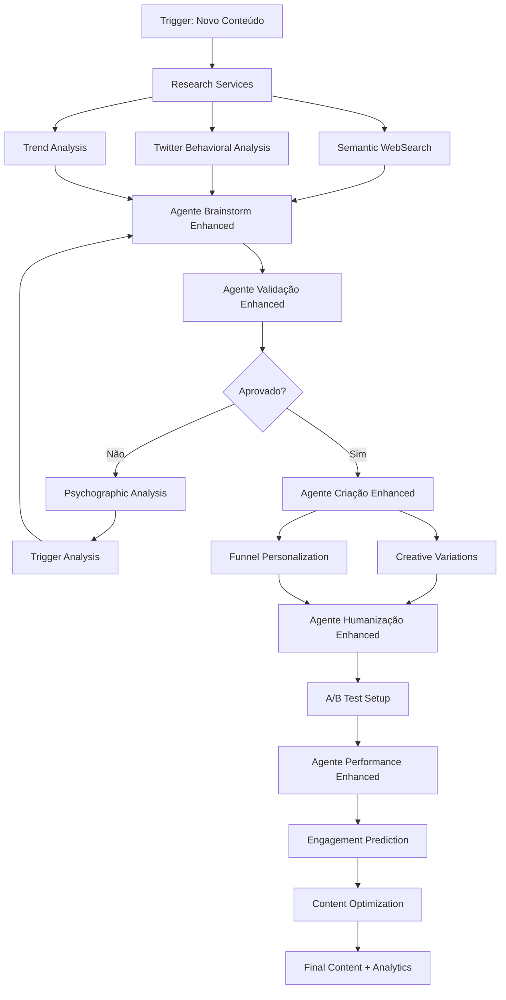
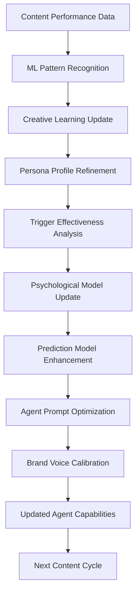

# 🚀 Arquitetura de Endpoints - Plataforma de Copywriting Avançada

## 🎯 Visão Geral da Arquitetura

Esta arquitetura expande o sistema de Calendário Editorial Twitter com endpoints especializados em copywriting que preservam a criatividade humana enquanto maximizam performance através de dados comportamentais e análise psicológica avançada.

### 🧠 Princípios Fundamentais
- **Preservação da Criatividade**: Evitar padronização excessiva mantendo unicidade
- **Compreensão Psicológica**: Análise profunda de gatilhos mentais e comportamentos
- **Personalização Contextual**: Adaptação por persona e estágio do funil
- **Aprendizado Contínuo**: ML que evolui sem homogeneizar outputs
- **Autenticidade da Marca**: Manutenção da voz única enquanto otimiza performance

---

## 🏗️ Arquitetura de Microserviços

```
┌─────────────────────────────────────────────────────────────────┐
│                    API GATEWAY & LOAD BALANCER                 │
│                     (Rate Limiting & Auth)                     │
└─────────────────────────────────────────────────────────────────┘
                                    │
        ┌───────────────────────────┼───────────────────────────┐
        │                           │                           │
┌───────▼────────┐        ┌────────▼────────┐        ┌────────▼────────┐
│   RESEARCH     │        │   COPYWRITING   │        │   ANALYTICS     │
│   SERVICES     │        │   SERVICES      │        │   SERVICES      │
│                │        │                 │        │                 │
│ • WebSearch    │◄──────►│ • Content Gen   │◄──────►│ • Performance   │
│ • Twitter API  │        │ • Personalization│        │ • Sentiment     │
│ • Trends       │        │ • A/B Testing   │        │ • Psychographics│
│ • Competitors  │        │ • Voice Matching│        │ • Predictions   │
└────────────────┘        └─────────────────┘        └─────────────────┘
        │                           │                           │
        └───────────────────────────┼───────────────────────────┘
                                    │
        ┌───────────────────────────▼───────────────────────────┐
        │                 ML & AI SERVICES                      │
        │                                                       │
        │ • Pattern Recognition    • Creativity Preservation    │
        │ • Behavioral Analysis    • Engagement Prediction      │
        │ • Psychological Profiling • Content Optimization     │
        └───────────────────────────────────────────────────────┘
```

---

## 🔍 RESEARCH SERVICES - Endpoints de Pesquisa Avançada

### 🌐 WebSearch Avançado com Análise Semântica

#### `POST /api/research/websearch/semantic`
```typescript
interface SemanticSearchRequest {
  query: string;
  context: {
    brand_voice: string;
    target_audience: string;
    content_type: 'educational' | 'promotional' | 'storytelling' | 'viral';
    industry: string;
    competitors?: string[];
  };
  filters: {
    date_range?: { start: string; end: string };
    content_types?: ('article' | 'video' | 'social' | 'research')[];
    sentiment?: 'positive' | 'negative' | 'neutral' | 'mixed';
    engagement_threshold?: number;
  };
  analysis_depth: 'surface' | 'deep' | 'comprehensive';
}

interface SemanticSearchResponse {
  results: {
    content: string;
    url: string;
    semantic_relevance: number; // 0-1
    psychological_triggers: string[];
    emotional_tone: {
      primary: string;
      secondary: string[];
      intensity: number;
    };
    copywriting_elements: {
      headlines: string[];
      hooks: string[];
      ctas: string[];
      social_proof: string[];
    };
    audience_insights: {
      demographics: object;
      psychographics: object;
      behavioral_patterns: string[];
    };
  }[];
  semantic_clusters: {
    theme: string;
    relevance: number;
    content_count: number;
    key_insights: string[];
  }[];
  competitive_gaps: string[];
  trending_angles: string[];
}
```

#### `POST /api/research/websearch/trend-analysis`
```typescript
interface TrendAnalysisRequest {
  keywords: string[];
  timeframe: '24h' | '7d' | '30d' | '90d' | '1y';
  geographic_scope: string[];
  industry_context: string;
  competitor_analysis: boolean;
}

interface TrendAnalysisResponse {
  trend_momentum: {
    keyword: string;
    growth_rate: number;
    peak_prediction: string;
    sustainability_score: number; // 0-100
    viral_potential: number; // 0-100
  }[];
  seasonal_patterns: {
    pattern_type: string;
    confidence: number;
    next_peak: string;
    historical_performance: object;
  }[];
  emerging_topics: {
    topic: string;
    emergence_velocity: number;
    related_keywords: string[];
    opportunity_score: number;
  }[];
  content_opportunities: {
    angle: string;
    difficulty: 'low' | 'medium' | 'high';
    potential_reach: number;
    recommended_format: string;
  }[];
}
```

### 🐦 Twitter Search com Filtros Comportamentais

#### `POST /api/research/twitter/behavioral-search`
```typescript
interface TwitterBehavioralSearchRequest {
  query: string;
  behavioral_filters: {
    engagement_patterns: {
      min_likes?: number;
      min_retweets?: number;
      min_replies?: number;
      engagement_velocity?: 'slow' | 'medium' | 'viral';
    };
    user_demographics: {
      follower_range?: { min: number; max: number };
      account_age?: { min_months: number };
      verification_status?: boolean;
      location?: string[];
    };
    content_psychology: {
      emotional_triggers?: string[];
      persuasion_techniques?: string[];
      content_format?: string[];
      timing_patterns?: string[];
    };
  };
  analysis_scope: {
    include_replies: boolean;
    include_threads: boolean;
    sentiment_analysis: boolean;
    influence_mapping: boolean;
  };
}

interface TwitterBehavioralSearchResponse {
  tweets: {
    id: string;
    content: string;
    author: {
      handle: string;
      followers: number;
      engagement_rate: number;
      influence_score: number;
      psychological_profile: {
        personality_traits: string[];
        communication_style: string;
        authority_indicators: string[];
      };
    };
    performance: {
      likes: number;
      retweets: number;
      replies: number;
      viral_coefficient: number;
      engagement_velocity: number;
    };
    psychological_analysis: {
      primary_trigger: string;
      secondary_triggers: string[];
      persuasion_techniques: string[];
      emotional_appeal: string;
      cognitive_biases_used: string[];
    };
    copywriting_breakdown: {
      hook_effectiveness: number;
      structure_analysis: string;
      cta_presence: boolean;
      social_proof_elements: string[];
    };
  }[];
  behavioral_insights: {
    top_performing_patterns: string[];
    audience_preferences: object;
    optimal_posting_times: string[];
    content_format_preferences: object;
  };
  competitive_intelligence: {
    competitor: string;
    strategy_insights: string[];
    content_gaps: string[];
    opportunity_areas: string[];
  }[];
}
```

#### `POST /api/research/twitter/influence-mapping`
```typescript
interface InfluenceMappingRequest {
  topic: string;
  industry: string;
  influence_threshold: number;
  network_depth: 1 | 2 | 3;
}

interface InfluenceMappingResponse {
  influence_network: {
    node_id: string;
    handle: string;
    influence_score: number;
    specialization: string[];
    audience_overlap: number;
    collaboration_potential: number;
    content_style: {
      tone: string;
      format_preferences: string[];
      posting_frequency: string;
      engagement_style: string;
    };
  }[];
  network_insights: {
    key_conversation_drivers: string[];
    trending_narratives: string[];
    content_gaps: string[];
    collaboration_opportunities: string[];
  };
  audience_analysis: {
    shared_audience_size: number;
    demographic_overlap: object;
    interest_alignment: string[];
    engagement_patterns: object;
  };
}
```

---

## 📊 ANALYTICS SERVICES - Inteligência Comportamental

### 🧠 Análise de Sentimentos Contextualizada

#### `POST /api/analytics/sentiment/contextual`
```typescript
interface ContextualSentimentRequest {
  content: string;
  context: {
    brand_context: string;
    audience_segment: string;
    content_purpose: string;
    cultural_context?: string;
  };
  analysis_depth: 'basic' | 'advanced' | 'psychological';
}

interface ContextualSentimentResponse {
  sentiment_analysis: {
    overall_sentiment: {
      polarity: number; // -1 to 1
      subjectivity: number; // 0 to 1
      confidence: number;
    };
    emotional_dimensions: {
      joy: number;
      trust: number;
      fear: number;
      surprise: number;
      sadness: number;
      disgust: number;
      anger: number;
      anticipation: number;
    };
    psychological_impact: {
      persuasion_strength: number;
      credibility_score: number;
      emotional_resonance: number;
      action_likelihood: number;
    };
  };
  contextual_insights: {
    brand_alignment: number;
    audience_resonance: number;
    cultural_sensitivity: number;
    timing_appropriateness: number;
  };
  optimization_suggestions: {
    emotional_adjustments: string[];
    tone_modifications: string[];
    structural_improvements: string[];
    psychological_enhancements: string[];
  };
}
```

### 🎯 Extração de Insights Psicográficos

#### `POST /api/analytics/psychographics/extract`
```typescript
interface PsychographicExtractionRequest {
  data_sources: {
    social_content?: string[];
    engagement_data?: object[];
    survey_responses?: object[];
    behavioral_data?: object[];
  };
  analysis_framework: 'big5' | 'values' | 'lifestyle' | 'comprehensive';
  audience_segment: string;
}

interface PsychographicExtractionResponse {
  personality_profile: {
    big_five: {
      openness: number;
      conscientiousness: number;
      extraversion: number;
      agreeableness: number;
      neuroticism: number;
    };
    values_system: {
      primary_values: string[];
      value_hierarchy: string[];
      motivational_drivers: string[];
    };
    lifestyle_indicators: {
      interests: string[];
      activities: string[];
      opinions: string[];
      consumption_patterns: string[];
    };
  };
  communication_preferences: {
    preferred_tone: string;
    content_format_preferences: string[];
    information_processing_style: string;
    decision_making_factors: string[];
  };
  psychological_triggers: {
    primary_motivators: string[];
    fear_factors: string[];
    aspiration_drivers: string[];
    social_influences: string[];
  };
  copywriting_recommendations: {
    messaging_angles: string[];
    emotional_appeals: string[];
    logical_arguments: string[];
    social_proof_types: string[];
  };
}
```

### 🎪 Identificação de Gatilhos Mentais por Nicho

#### `POST /api/analytics/triggers/niche-analysis`
```typescript
interface NicheTriggerAnalysisRequest {
  niche: string;
  content_samples: string[];
  performance_data: {
    content_id: string;
    engagement_metrics: object;
    conversion_data?: object;
  }[];
  competitor_analysis: boolean;
}

interface NicheTriggerAnalysisResponse {
  niche_specific_triggers: {
    trigger_name: string;
    effectiveness_score: number;
    usage_frequency: number;
    optimal_contexts: string[];
    implementation_examples: string[];
    psychological_mechanism: string;
  }[];
  trigger_combinations: {
    combination: string[];
    synergy_score: number;
    use_cases: string[];
    performance_lift: number;
  }[];
  audience_trigger_mapping: {
    audience_segment: string;
    most_effective_triggers: string[];
    trigger_sensitivity: object;
    optimal_intensity: string;
  }[];
  competitive_trigger_analysis: {
    competitor: string;
    signature_triggers: string[];
    trigger_gaps: string[];
    differentiation_opportunities: string[];
  }[];
}
```

---

## ✍️ COPYWRITING SERVICES - Geração Inteligente

### 🎨 Geração de Variações Criativas

#### `POST /api/copywriting/variations/creative`
```typescript
interface CreativeVariationsRequest {
  base_content: string;
  variation_parameters: {
    tone_variations: string[];
    structure_variations: string[];
    psychological_angles: string[];
    creativity_level: 'conservative' | 'moderate' | 'bold' | 'experimental';
  };
  brand_constraints: {
    voice_guidelines: string;
    forbidden_words: string[];
    required_elements: string[];
    brand_personality: string[];
  };
  target_metrics: {
    primary_goal: 'awareness' | 'engagement' | 'conversion' | 'viral';
    secondary_goals: string[];
    success_criteria: object;
  };
}

interface CreativeVariationsResponse {
  variations: {
    id: string;
    content: string;
    variation_type: string;
    creativity_score: number;
    predicted_performance: {
      engagement_score: number;
      viral_potential: number;
      conversion_likelihood: number;
      brand_alignment: number;
    };
    psychological_analysis: {
      primary_appeal: string;
      cognitive_load: number;
      emotional_intensity: number;
      persuasion_techniques: string[];
    };
    differentiation_factors: string[];
    risk_assessment: {
      brand_risk: 'low' | 'medium' | 'high';
      audience_risk: 'low' | 'medium' | 'high';
      performance_risk: 'low' | 'medium' | 'high';
    };
  }[];
  optimization_insights: {
    best_performing_elements: string[];
    improvement_opportunities: string[];
    a_b_test_recommendations: string[];
  };
}
```

### 🎭 Personalização por Persona e Funil

#### `POST /api/copywriting/personalization/funnel-stage`
```typescript
interface FunnelPersonalizationRequest {
  base_message: string;
  persona_profile: {
    demographic: object;
    psychographic: object;
    behavioral_patterns: string[];
    pain_points: string[];
    aspirations: string[];
  };
  funnel_stage: 'awareness' | 'interest' | 'consideration' | 'intent' | 'purchase' | 'retention';
  context: {
    channel: string;
    timing: string;
    previous_interactions: object[];
    competitive_context: string;
  };
}

interface FunnelPersonalizationResponse {
  personalized_content: {
    primary_version: string;
    alternative_versions: string[];
    personalization_elements: {
      demographic_adaptations: string[];
      psychographic_alignments: string[];
      behavioral_triggers: string[];
      stage_specific_elements: string[];
    };
  };
  psychological_rationale: {
    persona_alignment_score: number;
    stage_appropriateness: number;
    persuasion_pathway: string[];
    expected_response: string;
  };
  optimization_recommendations: {
    next_stage_preparation: string[];
    cross_channel_consistency: string[];
    follow_up_strategies: string[];
  };
}
```

### 🧪 Sistema de A/B Testing Inteligente

#### `POST /api/copywriting/ab-testing/intelligent-setup`
```typescript
interface IntelligentABTestRequest {
  content_variants: string[];
  test_parameters: {
    audience_segments: string[];
    test_duration: string;
    success_metrics: string[];
    statistical_significance: number;
  };
  hypothesis: {
    primary_hypothesis: string;
    secondary_hypotheses: string[];
    expected_outcomes: object;
  };
  learning_objectives: string[];
}

interface IntelligentABTestResponse {
  test_configuration: {
    test_id: string;
    variant_distribution: object;
    audience_allocation: object;
    duration_recommendation: string;
    sample_size_calculation: object;
  };
  predictive_analysis: {
    expected_winner: string;
    confidence_interval: number;
    performance_predictions: object;
    risk_assessment: object;
  };
  learning_framework: {
    key_learnings_to_extract: string[];
    data_collection_points: string[];
    analysis_methodology: string;
  };
}
```

---

## 🤖 ML & AI SERVICES - Aprendizado Preservando Criatividade

### 🧠 Pattern Recognition sem Homogeneização

#### `POST /api/ml/patterns/creative-learning`
```typescript
interface CreativeLearningRequest {
  training_data: {
    content_samples: string[];
    performance_metrics: object[];
    audience_feedback: object[];
    brand_context: string;
  };
  learning_constraints: {
    creativity_preservation: number; // 0-1
    pattern_sensitivity: number; // 0-1
    innovation_encouragement: number; // 0-1
  };
  output_diversity_requirements: {
    minimum_variation: number;
    style_diversity: string[];
    approach_diversity: string[];
  };
}

interface CreativeLearningResponse {
  learned_patterns: {
    pattern_type: string;
    pattern_description: string;
    effectiveness_score: number;
    creativity_impact: number;
    application_contexts: string[];
  }[];
  creativity_preservation_metrics: {
    uniqueness_score: number;
    innovation_index: number;
    pattern_breaking_frequency: number;
  };
  recommendations: {
    pattern_applications: string[];
    creative_opportunities: string[];
    innovation_suggestions: string[];
  };
}
```

### 📈 Engagement Prediction com Contexto Psicológico

#### `POST /api/ml/prediction/engagement-psychology`
```typescript
interface EngagementPredictionRequest {
  content: string;
  context: {
    audience_profile: object;
    timing_context: string;
    channel_context: string;
    competitive_landscape: string;
  };
  psychological_factors: {
    audience_mood: string;
    cultural_context: string;
    seasonal_factors: string[];
    trending_topics: string[];
  };
}

interface EngagementPredictionResponse {
  engagement_prediction: {
    overall_score: number;
    confidence_interval: { min: number; max: number };
    breakdown: {
      likes_prediction: number;
      shares_prediction: number;
      comments_prediction: number;
      saves_prediction: number;
    };
  };
  psychological_analysis: {
    emotional_resonance: number;
    cognitive_appeal: number;
    social_validation_potential: number;
    action_motivation: number;
  };
  optimization_suggestions: {
    high_impact_changes: string[];
    psychological_enhancements: string[];
    timing_optimizations: string[];
  };
}
```

---

## 🔄 INTEGRAÇÃO COM AGENTES IA EXISTENTES

### 🔗 Enhanced Agent Communication Protocol

```typescript
// Protocolo de comunicação expandido entre agentes
interface EnhancedAgentProtocol {
  // Agente Brainstorm Enhanced
  brainstorm_enhanced: {
    input: {
      research_data: SemanticSearchResponse;
      trend_analysis: TrendAnalysisResponse;
      psychographic_insights: PsychographicExtractionResponse;
    };
    output: {
      creative_concepts: object[];
      psychological_rationale: object;
      differentiation_strategy: string;
    };
  };

  // Agente Validação Enhanced
  validation_enhanced: {
    input: {
      creative_concepts: object[];
      behavioral_data: TwitterBehavioralSearchResponse;
      sentiment_analysis: ContextualSentimentResponse;
    };
    output: {
      validation_score: number;
      psychological_effectiveness: number;
      risk_assessment: object;
      optimization_recommendations: string[];
    };
  };

  // Agente Criação Enhanced
  creation_enhanced: {
    input: {
      validated_concepts: object[];
      persona_data: object;
      funnel_context: string;
    };
    output: {
      content_variations: CreativeVariationsResponse;
      personalized_versions: object[];
      ab_test_setup: IntelligentABTestResponse;
    };
  };

  // Agente Humanização Enhanced
  humanization_enhanced: {
    input: {
      generated_content: object[];
      brand_voice_analysis: object;
      authenticity_requirements: object;
    };
    output: {
      humanized_content: string[];
      authenticity_score: number;
      voice_alignment: number;
    };
  };

  // Agente Performance Enhanced
  performance_enhanced: {
    input: {
      final_content: string[];
      prediction_models: object;
      historical_performance: object[];
    };
    output: {
      performance_predictions: EngagementPredictionResponse;
      optimization_insights: object;
      learning_feedback: CreativeLearningResponse;
    };
  };
}
```

---

## 🚀 FLUXOS AUTOMATIZADOS INTEGRADOS

### 📊 Fluxo de Criação de Conteúdo Inteligente



### 🎯 Fluxo de Otimização Contínua



---

## 📋 IMPLEMENTAÇÃO TÉCNICA

### 🛠️ Stack Tecnológico Expandido

```typescript
// Configuração de Microserviços
const microservicesConfig = {
  research_service: {
    framework: 'FastAPI',
    database: 'PostgreSQL + Vector DB',
    cache: 'Redis',
    ml_models: ['BERT', 'GPT-4', 'Custom Sentiment Models'],
    apis: ['Tavily', 'Twitter API v2', 'Google Trends', 'NewsAPI']
  },
  
  copywriting_service: {
    framework: 'Node.js + Express',
    database: 'Supabase',
    ai_models: ['GPT-4', 'Claude-3', 'Custom Fine-tuned Models'],
    ml_pipeline: 'TensorFlow + PyTorch',
    creativity_engine: 'Custom Neural Architecture'
  },
  
  analytics_service: {
    framework: 'Python + Django',
    database: 'ClickHouse + PostgreSQL',
    ml_stack: ['scikit-learn', 'XGBoost', 'Custom Models'],
    real_time: 'Apache Kafka + Redis Streams'
  },
  
  ml_service: {
    framework: 'Python + MLflow',
    compute: 'GPU Clusters',
    model_serving: 'TensorFlow Serving',
    experiment_tracking: 'Weights & Biases'
  }
};
```

### 🔐 Segurança e Rate Limiting

```typescript
// Configuração de Segurança
const securityConfig = {
  authentication: {
    method: 'JWT + OAuth2',
    token_expiry: '24h',
    refresh_token: '30d',
    mfa_required: true
  },
  
  rate_limiting: {
    research_endpoints: '100/hour',
    copywriting_endpoints: '50/hour',
    ml_endpoints: '20/hour',
    premium_multiplier: 5
  },
  
  data_protection: {
    encryption: 'AES-256',
    pii_handling: 'GDPR Compliant',
    data_retention: '2 years',
    anonymization: 'Automatic'
  }
};
```

---

## 📊 MÉTRICAS E MONITORAMENTO

### 🎯 KPIs de Criatividade e Performance

```typescript
interface CreativityMetrics {
  uniqueness_score: number; // 0-100
  innovation_index: number; // 0-100
  pattern_breaking_frequency: number; // %
  creative_diversity: number; // 0-100
  authenticity_preservation: number; // 0-100
}

interface PerformanceMetrics {
  engagement_prediction_accuracy: number; // %
  conversion_lift: number; // %
  brand_voice_consistency: number; // 0-100
  audience_resonance: number; // 0-100
  competitive_differentiation: number; // 0-100
}

interface SystemMetrics {
  api_response_time: number; // ms
  model_inference_time: number; // ms
  content_generation_speed: number; // content/min
  system_uptime: number; // %
  error_rate: number; // %
}
```

---

## 🚀 ROADMAP DE IMPLEMENTAÇÃO

### 📅 Cronograma de Desenvolvimento

#### **FASE 1: Fundação (4 semanas)**
- [ ] Setup da arquitetura de microserviços
- [ ] Implementação dos Research Services básicos
- [ ] Integração com APIs externas (Tavily, Twitter, etc.)
- [ ] Sistema de autenticação e rate limiting

#### **FASE 2: Core Services (6 semanas)**
- [ ] Desenvolvimento dos Analytics Services
- [ ] Implementação dos Copywriting Services
- [ ] Sistema de ML básico para pattern recognition
- [ ] Integração com agentes IA existentes

#### **FASE 3: Inteligência Avançada (8 semanas)**
- [ ] ML Services completos com creativity preservation
- [ ] Sistema de A/B testing inteligente
- [ ] Análise psicográfica avançada
- [ ] Otimização de performance em tempo real

#### **FASE 4: Integração e Otimização (4 semanas)**
- [ ] Fluxos automatizados completos
- [ ] Dashboard de monitoramento
- [ ] Testes de carga e otimização
- [ ] Documentação e treinamento

---

**Status**: 🏗️ Arquitetura Completa Definida  
**Próximo Passo**: Implementação dos microserviços seguindo a sequência  
**Duração Estimada**: 22 semanas para sistema completo  
**Integração**: Totalmente compatível com sistema de Calendário Editorial existente