# 📚 Documentação Técnica Integrada - Plataforma de Copywriting Avançada

## 🎯 Visão Geral da Integração

Esta documentação consolida a arquitetura completa da plataforma, integrando o sistema original de Calendário Editorial Twitter com a nova arquitetura robusta de endpoints de copywriting que preserva criatividade e maximiza performance através de análise psicológica e dados comportamentais.

---

## 🏗️ Arquitetura Completa Integrada

### 🔄 Fluxo de Dados End-to-End

```mermaid
graph TD
    A[Usuário Input] --> B[Research Services]
    B --> C[WebSearch Semântico]
    B --> D[Twitter Behavioral Analysis]
    B --> E[Trend Analysis]
    
    C --> F[Agente Brainstorm Enhanced]
    D --> F
    E --> F
    
    F --> G[Agente Validação Enhanced]
    G --> H{Score > 0.7?}
    
    H -->|Não| I[Psychographic Analysis]
    I --> J[Mental Trigger Analysis]
    J --> F
    
    H -->|Sim| K[Agente Criação Enhanced]
    K --> L[Creative Variations Engine]
    K --> M[Personalization by Funnel]
    
    L --> N[Agente Humanização Enhanced]
    M --> N
    
    N --> O[A/B Test Intelligence]
    O --> P[Agente Performance Enhanced]
    
    P --> Q[Engagement Prediction]
    Q --> R[ML Pattern Learning]
    R --> S[Final Content + Analytics]
    
    S --> T[Calendário Editorial]
    S --> U[Performance Dashboard]
    S --> V[Continuous Learning Loop]
```



### 🧠 Sistema de Agentes IA Expandido

```typescript
interface ExpandedAgentSystem {
  // Agentes Core (Originais)
  brainstorm_agent: {
    enhanced_capabilities: [
      'semantic_research_integration',
      'behavioral_data_analysis',
      'trend_correlation',
      'psychographic_insights'
    ];
    new_tools: ['tavily_api', 'twitter_behavioral', 'psychographic_profiler'];
  };
  
  validation_agent: {
    enhanced_capabilities: [
      'psychological_effectiveness_scoring',
      'viral_potential_prediction',
      'brand_risk_assessment',
      'cultural_sensitivity_analysis'
    ];
    new_tools: ['sentiment_analyzer', 'trigger_detector', 'risk_assessor'];
  };
  
  creation_agent: {
    enhanced_capabilities: [
      'creative_variations_generation',
      'persona_based_personalization',
      'funnel_stage_optimization',
      'ab_test_hypothesis_creation'
    ];
    new_tools: ['variation_engine', 'personalization_ai', 'test_designer'];
  };
  
  humanization_agent: {
    enhanced_capabilities: [
      'voice_authenticity_preservation',
      'brand_alignment_optimization',
      'emotional_resonance_tuning',
      'cultural_context_adaptation'
    ];
    new_tools: ['voice_analyzer', 'authenticity_checker', 'cultural_adapter'];
  };
  
  performance_agent: {
    enhanced_capabilities: [
      'psychological_engagement_prediction',
      'behavioral_pattern_learning',
      'competitive_benchmarking',
      'optimization_recommendation'
    ];
    new_tools: ['prediction_models', 'pattern_learner', 'benchmark_analyzer'];
  };
  
  // Novos Agentes Especializados
  research_coordinator: {
    responsibilities: [
      'orchestrate_multi_source_research',
      'synthesize_behavioral_insights',
      'identify_content_opportunities',
      'competitive_intelligence_gathering'
    ];
    tools: ['multi_api_orchestrator', 'insight_synthesizer', 'opportunity_detector'];
  };
  
  psychology_analyst: {
    responsibilities: [
      'deep_psychographic_profiling',
      'mental_trigger_identification',
      'emotional_journey_mapping',
      'persuasion_pathway_optimization'
    ];
    tools: ['psychographic_profiler', 'trigger_mapper', 'emotion_analyzer'];
  };
  
  creativity_preservator: {
    responsibilities: [
      'maintain_creative_uniqueness',
      'prevent_content_homogenization',
      'encourage_innovative_approaches',
      'balance_performance_vs_creativity'
    ];
    tools: ['uniqueness_scorer', 'diversity_enforcer', 'innovation_catalyst'];
  };
}
```

---

## 🔍 Endpoints de Research Intelligence

### 📊 Matriz de Capabilities

| Endpoint | Funcionalidade | Input | Output | Preservação Criativa |
|----------|----------------|-------|--------|---------------------|
| `/api/research/websearch/semantic` | Busca semântica avançada | Query + Context | Insights estruturados | ✅ Diversidade de fontes |
| `/api/research/twitter/behavioral-search` | Análise comportamental Twitter | Filtros + Psicologia | Padrões de engajamento | ✅ Múltiplas perspectivas |
| `/api/research/twitter/influence-mapping` | Mapeamento de influência | Tópico + Rede | Network insights | ✅ Identificação de nichos únicos |
| `/api/analytics/sentiment/contextual` | Sentiment contextualizado | Conteúdo + Contexto | Análise emocional | ✅ Nuances culturais |
| `/api/analytics/psychographics/extract` | Perfil psicográfico | Dados comportamentais | Insights psicológicos | ✅ Personalização autêntica |
| `/api/analytics/triggers/niche-analysis` | Gatilhos por nicho | Nicho + Amostras | Triggers específicos | ✅ Abordagens diferenciadas |

### 🎯 Fluxo de Preservação da Criatividade

```typescript
interface CreativityPreservationFlow {
  input_diversification: {
    multiple_data_sources: string[];
    perspective_variation: string[];
    cultural_context_inclusion: boolean;
  };
  
  processing_constraints: {
    uniqueness_threshold: number; // 0.8+ required
    pattern_breaking_frequency: number; // 20% minimum
    innovation_encouragement: number; // 0.7+ weight
  };
  
  output_validation: {
    similarity_check: boolean;
    originality_score: number;
    creative_diversity_index: number;
  };
  
  feedback_loop: {
    human_creativity_integration: boolean;
    community_validation: boolean;
    continuous_learning: boolean;
  };
}
```

---

## ✍️ Copywriting Engine Avançado

### 🎨 Sistema de Variações Criativas

```typescript
interface AdvancedCopywritingEngine {
  variation_generation: {
    models_used: ['gpt-4-turbo', 'claude-3-opus', 'custom-fine-tuned'];
    creativity_levels: ['conservative', 'moderate', 'bold', 'experimental'];
    psychological_angles: string[];
    structure_variations: string[];
  };
  
  personalization_matrix: {
    persona_dimensions: {
      demographic: object;
      psychographic: object;
      behavioral: object;
      contextual: object;
    };
    funnel_stages: ['awareness', 'interest', 'consideration', 'intent', 'purchase', 'retention'];
    adaptation_strategies: string[];
  };
  
  quality_assurance: {
    brand_constraint_validation: boolean;
    psychological_effectiveness_scoring: number;
    viral_potential_prediction: number;
    authenticity_preservation: number;
  };
  
  learning_system: {
    performance_feedback_integration: boolean;
    pattern_recognition_without_homogenization: boolean;
    creative_boundary_expansion: boolean;
  };
}
```

### 🧪 A/B Testing Inteligente

```typescript
interface IntelligentABTesting {
  hypothesis_generation: {
    psychological_basis: string;
    expected_outcome: object;
    success_metrics: string[];
    risk_assessment: object;
  };
  
  test_design: {
    variant_optimization: boolean;
    audience_segmentation: object;
    statistical_power_calculation: number;
    duration_optimization: string;
  };
  
  learning_extraction: {
    pattern_identification: string[];
    psychological_insights: object;
    creative_learnings: string[];
    strategic_implications: string[];
  };
}
```

---

## 🤖 Machine Learning que Preserva Criatividade

### 🧠 Arquitetura de ML Consciente

```python
class CreativityPreservingML:
    def __init__(self):
        self.creativity_constraints = {
            'uniqueness_threshold': 0.8,
            'pattern_breaking_frequency': 0.2,
            'innovation_weight': 0.7,
            'diversity_enforcement': True
        }
        
        self.learning_models = {
            'engagement_predictor': 'ensemble_model',
            'creativity_scorer': 'custom_neural_network',
            'authenticity_validator': 'fine_tuned_transformer',
            'pattern_recognizer': 'unsupervised_clustering'
        }
    
    def learn_patterns_preserving_creativity(self, training_data):
        """
        Aprende padrões sem homogeneizar outputs criativos
        """
        # 1. Identificar padrões de sucesso
        success_patterns = self.identify_success_patterns(training_data)
        
        # 2. Preservar diversidade criativa
        creative_boundaries = self.define_creative_boundaries(training_data)
        
        # 3. Balancear performance vs criatividade
        balanced_model = self.balance_performance_creativity(
            success_patterns, 
            creative_boundaries
        )
        
        # 4. Validar preservação de unicidade
        uniqueness_score = self.validate_uniqueness(balanced_model)
        
        return balanced_model if uniqueness_score > 0.8 else self.retrain()
    
    def predict_engagement_with_creativity_bonus(self, content):
        """
        Prediz engajamento considerando bônus de criatividade
        """
        base_prediction = self.engagement_predictor.predict(content)
        creativity_score = self.creativity_scorer.score(content)
        uniqueness_bonus = self.calculate_uniqueness_bonus(content)
        
        final_prediction = base_prediction * (1 + creativity_score * 0.3 + uniqueness_bonus * 0.2)
        
        return {
            'engagement_prediction': final_prediction,
            'creativity_contribution': creativity_score * 0.3,
            'uniqueness_contribution': uniqueness_bonus * 0.2,
            'confidence_interval': self.calculate_confidence(content)
        }
```

### 📊 Métricas de Preservação Criativa

```typescript
interface CreativityMetrics {
  uniqueness_score: {
    calculation: 'cosine_similarity_inverse';
    threshold: 0.8;
    weight: 0.3;
  };
  
  innovation_index: {
    calculation: 'pattern_breaking_frequency';
    minimum_required: 0.2;
    weight: 0.25;
  };
  
  diversity_score: {
    calculation: 'content_variation_analysis';
    target_range: [0.7, 1.0];
    weight: 0.25;
  };
  
  authenticity_preservation: {
    calculation: 'brand_voice_consistency';
    minimum_threshold: 0.85;
    weight: 0.2;
  };
}
```

---

## 🔄 Fluxos Automatizados Integrados

### 📈 Fluxo de Otimização Contínua

```typescript
class ContinuousOptimizationFlow {
  async executeOptimizationCycle(contentPerformanceData: any) {
    // 1. Análise de Performance
    const performanceInsights = await this.analyzePerformance(contentPerformanceData);
    
    // 2. Identificação de Padrões Criativos de Sucesso
    const creativeSuccessPatterns = await this.identifyCreativePatterns(performanceInsights);
    
    // 3. Atualização de Modelos Preservando Criatividade
    const updatedModels = await this.updateModelsWithCreativityConstraints(
      creativeSuccessPatterns
    );
    
    // 4. Refinamento de Personas Psicográficas
    const refinedPersonas = await this.refinePersonaProfiles(performanceInsights);
    
    // 5. Otimização de Gatilhos Mentais
    const optimizedTriggers = await this.optimizeMentalTriggers(performanceInsights);
    
    // 6. Calibração de Voz da Marca
    const calibratedVoice = await this.calibrateBrandVoice(performanceInsights);
    
    // 7. Atualização de Capacidades dos Agentes
    await this.updateAgentCapabilities({
      models: updatedModels,
      personas: refinedPersonas,
      triggers: optimizedTriggers,
      voice: calibratedVoice
    });
    
    return {
      optimization_summary: this.generateOptimizationSummary(),
      creativity_preservation_score: this.calculateCreativityPreservation(),
      performance_improvement_prediction: this.predictPerformanceImprovement(),
      next_optimization_schedule: this.scheduleNextOptimization()
    };
  }
}
```

### 🎯 Fluxo de Criação Inteligente

```typescript
class IntelligentContentCreationFlow {
  async createContentWithPsychologicalIntelligence(userInput: any) {
    // 1. Research Intelligence Gathering
    const researchData = await this.gatherResearchIntelligence(userInput);
    
    // 2. Psychological Profile Analysis
    const psychProfile = await this.analyzePsychologicalProfile(
      userInput.audience_data,
      researchData.behavioral_insights
    );
    
    // 3. Enhanced Brainstorm with Creativity Constraints
    const creativeIdeas = await this.enhancedBrainstorm({
      input: userInput,
      research: researchData,
      psychology: psychProfile,
      creativity_constraints: this.getCreativityConstraints()
    });
    
    // 4. Multi-dimensional Validation
    const validationResult = await this.multiDimensionalValidation({
      ideas: creativeIdeas,
      psychological_effectiveness: true,
      viral_potential: true,
      brand_alignment: true,
      cultural_sensitivity: true
    });
    
    // 5. Creative Variations with Personalization
    const contentVariations = await this.generateCreativeVariations({
      validated_concepts: validationResult.approved_concepts,
      personalization_matrix: psychProfile.personalization_matrix,
      creativity_level: userInput.creativity_level || 'bold'
    });
    
    // 6. Humanization with Authenticity Preservation
    const humanizedContent = await this.humanizeWithAuthenticity({
      variations: contentVariations,
      brand_voice: userInput.brand_voice,
      authenticity_requirements: userInput.authenticity_requirements
    });
    
    // 7. Performance Prediction with Psychology
    const performancePrediction = await this.predictPerformanceWithPsychology({
      content: humanizedContent,
      audience_psychology: psychProfile,
      contextual_factors: researchData.contextual_factors
    });
    
    // 8. A/B Test Intelligence Setup
    const abTestSetup = await this.setupIntelligentABTest({
      content_variations: humanizedContent.top_variations,
      psychological_hypotheses: performancePrediction.hypotheses,
      success_criteria: userInput.success_criteria
    });
    
    return {
      final_content: humanizedContent.optimized_content,
      performance_predictions: performancePrediction,
      ab_test_configuration: abTestSetup,
      psychological_insights: psychProfile.key_insights,
      creativity_metrics: this.calculateCreativityMetrics(humanizedContent),
      optimization_recommendations: this.generateOptimizationRecommendations()
    };
  }
}
```

---

## 📊 Sistema de Monitoramento e Métricas

### 🎯 Dashboard de Performance Integrado

```typescript
interface IntegratedPerformanceDashboard {
  creativity_metrics: {
    uniqueness_score: number;
    innovation_index: number;
    diversity_score: number;
    authenticity_preservation: number;
  };
  
  psychological_effectiveness: {
    emotional_resonance: number;
    persuasion_strength: number;
    trigger_effectiveness: number;
    audience_alignment: number;
  };
  
  performance_predictions: {
    engagement_prediction: number;
    viral_potential: number;
    conversion_likelihood: number;
    brand_impact: number;
  };
  
  system_health: {
    api_response_times: object;
    model_accuracy: object;
    creativity_preservation_rate: number;
    learning_effectiveness: number;
  };
  
  business_impact: {
    time_saved: number;
    engagement_improvement: number;
    conversion_lift: number;
    brand_consistency: number;
  };
}
```

### 📈 KPIs de Sucesso Expandidos

```typescript
interface ExpandedSuccessKPIs {
  // KPIs Originais
  original_kpis: {
    posts_above_average_engagement: 0.7; // 70%
    time_reduction_in_creation: 0.8; // 80%
    content_quality_approval: 0.95; // 95%
    follower_growth_increase: 0.3; // 30%
  };
  
  // Novos KPIs de Copywriting Avançado
  advanced_copywriting_kpis: {
    creativity_preservation_rate: 0.85; // 85%
    psychological_effectiveness_score: 0.8; // 80%
    personalization_accuracy: 0.9; // 90%
    viral_prediction_accuracy: 0.75; // 75%
    brand_voice_consistency: 0.95; // 95%
    cultural_sensitivity_score: 0.9; // 90%
  };
  
  // KPIs de Sistema ML
  ml_system_kpis: {
    pattern_learning_without_homogenization: 0.8; // 80%
    prediction_model_accuracy: 0.85; // 85%
    creative_diversity_maintenance: 0.9; // 90%
    continuous_learning_effectiveness: 0.8; // 80%
  };
  
  // KPIs de Negócio
  business_kpis: {
    customer_satisfaction_score: 0.9; // 90%
    platform_adoption_rate: 0.8; // 80%
    revenue_per_user_growth: 0.4; // 40%
    competitive_differentiation_score: 0.85; // 85%
  };
}
```

---

## 🚀 Roadmap de Implementação Integrado

### 📅 Cronograma Detalhado (26 semanas)

#### **FASE 1: Fundação Expandida (6 semanas)**
- **Semanas 1-2**: Setup da arquitetura de microserviços
- **Semanas 3-4**: Implementação dos Research Services
- **Semanas 5-6**: Sistema de autenticação e rate limiting avançado

#### **FASE 2: Core Services + Agentes Básicos (8 semanas)**
- **Semanas 7-8**: Desenvolvimento dos Analytics Services
- **Semanas 9-10**: Implementação dos Copywriting Services
- **Semanas 11-12**: Integração dos 5 agentes IA originais
- **Semanas 13-14**: Sistema de ML básico para pattern recognition

#### **FASE 3: Inteligência Avançada + Preservação Criativa (8 semanas)**
- **Semanas 15-16**: ML Services com creativity preservation
- **Semanas 17-18**: Sistema de A/B testing inteligente
- **Semanas 19-20**: Análise psicográfica avançada
- **Semanas 21-22**: Agentes especializados (Research Coordinator, Psychology Analyst)

#### **FASE 4: Integração e Otimização Final (4 semanas)**
- **Semanas 23-24**: Fluxos automatizados completos
- **Semanas 25-26**: Dashboard integrado, testes de carga e documentação

### 🎯 Critérios de Sucesso por Fase

```typescript
interface PhaseSuccessCriteria {
  phase_1: {
    microservices_uptime: 0.99;
    api_response_time: '<200ms';
    research_data_quality: 0.85;
  };
  
  phase_2: {
    agent_integration_success: 0.95;
    content_generation_quality: 0.8;
    user_satisfaction: 0.85;
  };
  
  phase_3: {
    creativity_preservation_rate: 0.85;
    ml_prediction_accuracy: 0.8;
    psychological_effectiveness: 0.8;
  };
  
  phase_4: {
    system_performance: 0.95;
    user_adoption: 0.8;
    business_kpi_achievement: 0.9;
  };
}
```

---

## 🔐 Segurança e Compliance

### 🛡️ Segurança de Dados Psicológicos

```typescript
interface PsychologicalDataSecurity {
  data_classification: {
    public: 'basic_demographics';
    internal: 'behavioral_patterns';
    confidential: 'psychological_profiles';
    restricted: 'personal_triggers';
  };
  
  encryption_standards: {
    at_rest: 'AES-256';
    in_transit: 'TLS 1.3';
    psychological_data: 'end_to_end_encryption';
  };
  
  access_controls: {
    role_based_access: boolean;
    psychological_data_access_logging: boolean;
    data_minimization: boolean;
    consent_management: boolean;
  };
  
  compliance: {
    gdpr: boolean;
    ccpa: boolean;
    psychological_research_ethics: boolean;
    ai_ethics_guidelines: boolean;
  };
}
```

---

## 📞 Suporte e Manutenção

### 🔧 Sistema de Monitoramento Avançado

```typescript
interface AdvancedMonitoringSystem {
  creativity_monitoring: {
    uniqueness_degradation_alerts: boolean;
    homogenization_detection: boolean;
    innovation_trend_tracking: boolean;
  };
  
  psychological_accuracy_monitoring: {
    prediction_accuracy_tracking: boolean;
    bias_detection: boolean;
    cultural_sensitivity_monitoring: boolean;
  };
  
  performance_monitoring: {
    real_time_metrics: boolean;
    predictive_maintenance: boolean;
    capacity_planning: boolean;
  };
  
  business_impact_monitoring: {
    roi_tracking: boolean;
    user_satisfaction_monitoring: boolean;
    competitive_analysis: boolean;
  };
}
```

---

**Status**: 🏗️ Arquitetura Técnica Integrada Completa  
**Versão**: 2.0.0  
**Última Atualização**: Dezembro 2024  
**Próximo Milestone**: Implementação Fase 1 - Fundação Expandida  

---

> 💡 **Inovação Chave**: Esta arquitetura integrada representa a primeira plataforma que combina criação de conteúdo automatizada com preservação consciente da criatividade humana, utilizando análise psicológica profunda e dados comportamentais em tempo real.

> 🎯 **Diferencial Competitivo**: Sistema de ML que aprende padrões de sucesso sem homogeneizar outputs criativos, mantendo a autenticidade da marca enquanto maximiza performance através de inteligência psicológica.