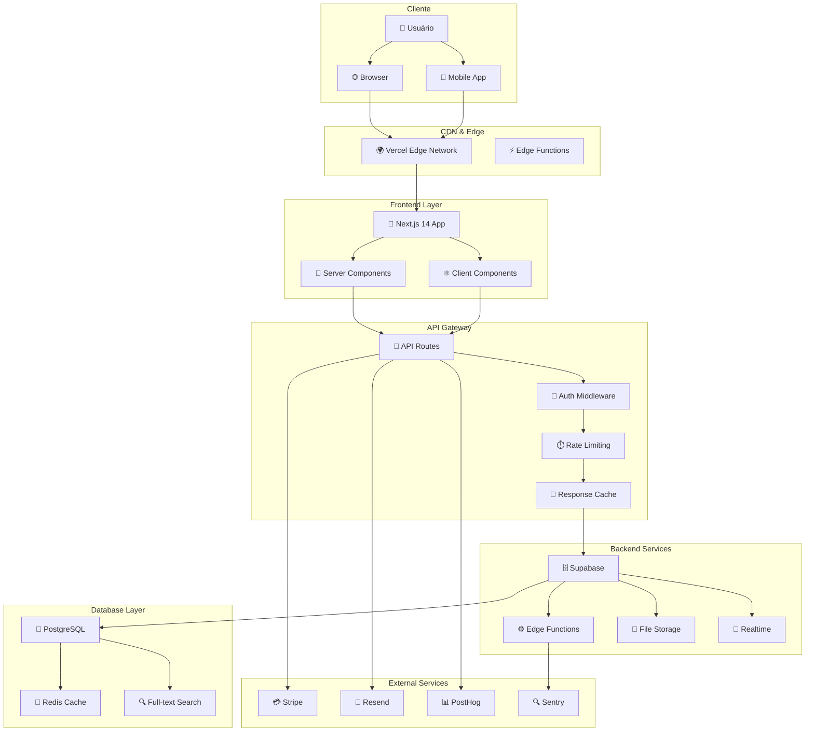
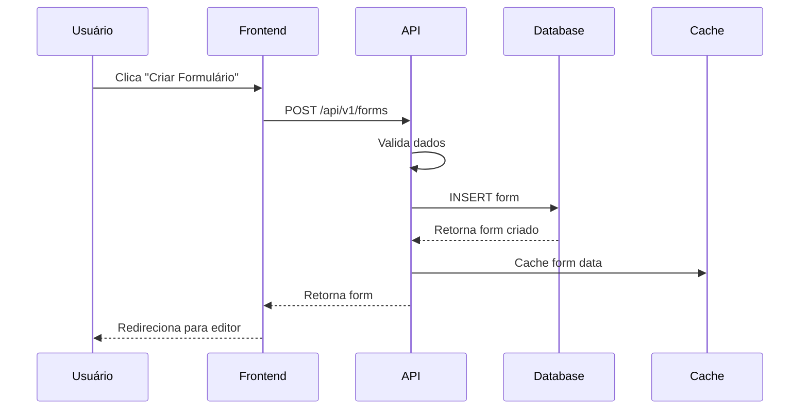
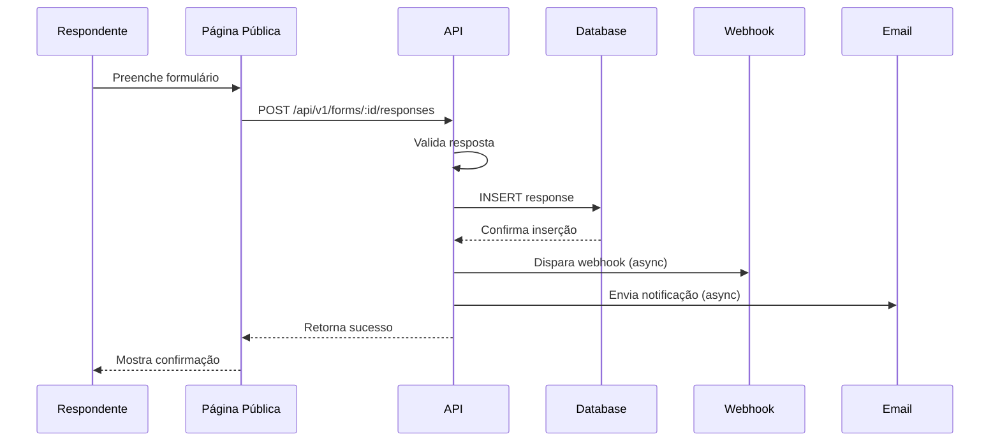
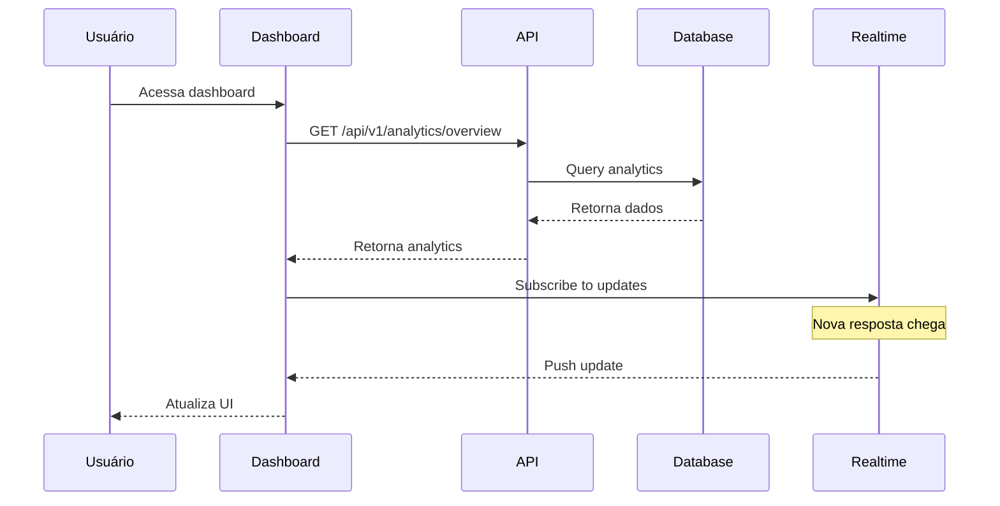

# 🏗️ Arquitetura Geral do Sistema
## YouForm - SaaS de Formulários Web

### 🎯 Visão Geral da Arquitetura

A arquitetura do YouForm foi projetada seguindo princípios de **simplicidade**, **escalabilidade** e **manutenibilidade**, utilizando uma stack moderna e battle-tested para garantir performance e confiabilidade.

### 📐 Diagrama de Arquitetura de Alto Nível



### 🏛️ Arquitetura em Camadas

#### 1. Presentation Layer (Camada de Apresentação)

**Next.js 14 com App Router**
```typescript
// Estrutura de diretórios
app/
├── (auth)/                 # Rotas autenticadas
│   ├── dashboard/         # Dashboard principal
│   ├── forms/            # Gerenciamento de formulários
│   └── settings/         # Configurações
├── (public)/             # Rotas públicas
│   ├── login/           # Autenticação
│   ├── pricing/         # Planos e preços
│   └── f/[id]/         # Formulários públicos
├── api/                 # API Routes
│   ├── auth/           # Endpoints de autenticação
│   ├── forms/          # CRUD de formulários
│   └── webhooks/       # Webhooks externos
└── globals.css         # Estilos globais
```

**Componentes Principais**
- **Server Components**: Para SEO e performance inicial
- **Client Components**: Para interatividade e estado
- **Streaming**: Para carregamento progressivo
- **Suspense**: Para loading states elegantes

#### 2. API Layer (Camada de API)

**Design RESTful com GraphQL Híbrido**
```typescript
// Estrutura de endpoints
/api/v1/
├── auth/
│   ├── POST /login
│   ├── POST /register
│   ├── POST /logout
│   └── GET /me
├── forms/
│   ├── GET /forms
│   ├── POST /forms
│   ├── GET /forms/:id
│   ├── PUT /forms/:id
│   └── DELETE /forms/:id
├── responses/
│   ├── GET /forms/:id/responses
│   ├── POST /forms/:id/responses
│   └── GET /responses/:id
└── analytics/
    ├── GET /forms/:id/stats
    └── GET /dashboard/overview
```

**Middleware Stack**
1. **CORS**: Configuração de origens permitidas
2. **Authentication**: Verificação de JWT tokens
3. **Authorization**: Controle de acesso baseado em roles
4. **Rate Limiting**: Proteção contra abuse
5. **Request Validation**: Validação de schemas
6. **Response Caching**: Cache inteligente de respostas
7. **Error Handling**: Tratamento padronizado de erros
8. **Logging**: Logs estruturados para debugging

#### 3. Business Logic Layer (Camada de Negócio)

**Services e Use Cases**
```typescript
// Estrutura de serviços
services/
├── auth/
│   ├── AuthService.ts
│   ├── TokenService.ts
│   └── PermissionService.ts
├── forms/
│   ├── FormService.ts
│   ├── FormBuilderService.ts
│   └── FormValidationService.ts
├── responses/
│   ├── ResponseService.ts
│   ├── ResponseAnalyticsService.ts
│   └── ResponseExportService.ts
└── notifications/
    ├── EmailService.ts
    ├── WebhookService.ts
    └── NotificationService.ts
```

**Domain Models**
```typescript
// Modelos de domínio
interface Form {
  id: string;
  userId: string;
  title: string;
  description?: string;
  fields: FormField[];
  settings: FormSettings;
  status: 'draft' | 'published' | 'archived';
  createdAt: Date;
  updatedAt: Date;
}

interface FormField {
  id: string;
  type: FieldType;
  label: string;
  placeholder?: string;
  required: boolean;
  validation?: ValidationRule[];
  options?: FieldOption[];
  logic?: ConditionalLogic[];
}

interface Response {
  id: string;
  formId: string;
  data: Record<string, any>;
  metadata: ResponseMetadata;
  submittedAt: Date;
}
```

#### 4. Data Access Layer (Camada de Dados)

**Supabase como Backend-as-a-Service**
- **PostgreSQL**: Banco principal com Row Level Security
- **Auth**: Sistema de autenticação integrado
- **Storage**: Armazenamento de arquivos
- **Realtime**: Subscriptions para updates em tempo real
- **Edge Functions**: Processamento serverless

**Repository Pattern**
```typescript
// Repositórios para abstração de dados
repositories/
├── FormRepository.ts
├── ResponseRepository.ts
├── UserRepository.ts
└── AnalyticsRepository.ts

// Exemplo de implementação
class FormRepository {
  async create(form: CreateFormDto): Promise<Form> {
    const { data, error } = await supabase
      .from('forms')
      .insert(form)
      .select()
      .single();
    
    if (error) throw new DatabaseError(error.message);
    return data;
  }
  
  async findByUserId(userId: string): Promise<Form[]> {
    const { data, error } = await supabase
      .from('forms')
      .select('*')
      .eq('user_id', userId)
      .order('created_at', { ascending: false });
    
    if (error) throw new DatabaseError(error.message);
    return data;
  }
}
```

### 🔄 Fluxos de Dados Principais

#### 1. Fluxo de Criação de Formulário



#### 2. Fluxo de Submissão de Resposta



#### 3. Fluxo de Analytics em Tempo Real



### 🔐 Arquitetura de Segurança

#### Autenticação e Autorização

**JWT + Refresh Token Strategy**
```typescript
// Fluxo de autenticação
interface AuthTokens {
  accessToken: string;    // 15 minutos
  refreshToken: string;   // 30 dias
  expiresAt: number;
}

// Middleware de autenticação
async function authMiddleware(req: Request) {
  const token = extractToken(req);
  
  try {
    const payload = verifyJWT(token);
    req.user = await getUserById(payload.sub);
    return next();
  } catch (error) {
    if (error instanceof TokenExpiredError) {
      return refreshTokenFlow(req);
    }
    throw new UnauthorizedError();
  }
}
```

**Row Level Security (RLS)**
```sql
-- Políticas de segurança no PostgreSQL
CREATE POLICY "Users can only see their own forms"
  ON forms FOR ALL
  USING (auth.uid() = user_id);

CREATE POLICY "Forms are publicly readable when published"
  ON forms FOR SELECT
  USING (status = 'published');

CREATE POLICY "Responses are only visible to form owners"
  ON responses FOR SELECT
  USING (
    EXISTS (
      SELECT 1 FROM forms 
      WHERE forms.id = responses.form_id 
      AND forms.user_id = auth.uid()
    )
  );
```

#### Proteção contra Ataques

**Rate Limiting**
```typescript
// Configuração de rate limiting
const rateLimits = {
  '/api/auth/login': { requests: 5, window: '15m' },
  '/api/forms': { requests: 100, window: '1h' },
  '/api/forms/:id/responses': { requests: 1000, window: '1h' },
  '/api/*': { requests: 1000, window: '15m' }
};

// Implementação com Redis
async function rateLimit(key: string, limit: RateLimit) {
  const current = await redis.incr(key);
  if (current === 1) {
    await redis.expire(key, limit.windowSeconds);
  }
  
  if (current > limit.requests) {
    throw new RateLimitExceededError();
  }
}
```

**Input Validation & Sanitization**
```typescript
// Schemas de validação com Zod
const createFormSchema = z.object({
  title: z.string().min(1).max(100).trim(),
  description: z.string().max(500).optional(),
  fields: z.array(formFieldSchema).min(1).max(50),
  settings: formSettingsSchema
});

// Sanitização de HTML
function sanitizeHtml(input: string): string {
  return DOMPurify.sanitize(input, {
    ALLOWED_TAGS: ['b', 'i', 'em', 'strong', 'a'],
    ALLOWED_ATTR: ['href']
  });
}
```

### 📊 Monitoramento e Observabilidade

#### Métricas de Sistema

**Application Performance Monitoring (APM)**
```typescript
// Instrumentação com Sentry
import * as Sentry from '@sentry/nextjs';

Sentry.init({
  dsn: process.env.SENTRY_DSN,
  tracesSampleRate: 0.1,
  beforeSend(event) {
    // Filtrar dados sensíveis
    if (event.request?.data) {
      event.request.data = sanitizeEventData(event.request.data);
    }
    return event;
  }
});

// Métricas customizadas
function trackFormCreation(userId: string, formType: string) {
  Sentry.addBreadcrumb({
    message: 'Form created',
    category: 'user_action',
    data: { userId, formType },
    level: 'info'
  });
}
```

**Health Checks**
```typescript
// Endpoint de health check
export async function GET() {
  const checks = await Promise.allSettled([
    checkDatabase(),
    checkRedis(),
    checkExternalServices()
  ]);
  
  const health = {
    status: 'healthy',
    timestamp: new Date().toISOString(),
    services: {
      database: checks[0].status === 'fulfilled' ? 'up' : 'down',
      cache: checks[1].status === 'fulfilled' ? 'up' : 'down',
      external: checks[2].status === 'fulfilled' ? 'up' : 'down'
    }
  };
  
  const isHealthy = Object.values(health.services).every(s => s === 'up');
  
  return Response.json(health, {
    status: isHealthy ? 200 : 503
  });
}
```

#### Logging Estruturado

```typescript
// Logger configurado
import winston from 'winston';

const logger = winston.createLogger({
  level: process.env.LOG_LEVEL || 'info',
  format: winston.format.combine(
    winston.format.timestamp(),
    winston.format.errors({ stack: true }),
    winston.format.json()
  ),
  defaultMeta: { service: 'youform-api' },
  transports: [
    new winston.transports.Console(),
    new winston.transports.File({ filename: 'error.log', level: 'error' }),
    new winston.transports.File({ filename: 'combined.log' })
  ]
});

// Uso em contexto
logger.info('Form created', {
  userId: user.id,
  formId: form.id,
  formType: form.type,
  duration: Date.now() - startTime
});
```

### 🚀 Estratégias de Performance

#### Caching Strategy

**Multi-Layer Caching**
```typescript
// 1. Browser Cache (Static Assets)
// next.config.js
const nextConfig = {
  async headers() {
    return [
      {
        source: '/static/(.*)',
        headers: [
          {
            key: 'Cache-Control',
            value: 'public, max-age=31536000, immutable'
          }
        ]
      }
    ];
  }
};

// 2. CDN Cache (Vercel Edge)
export const revalidate = 3600; // 1 hora

// 3. Application Cache (Redis)
async function getCachedForm(formId: string) {
  const cached = await redis.get(`form:${formId}`);
  if (cached) return JSON.parse(cached);
  
  const form = await db.forms.findById(formId);
  await redis.setex(`form:${formId}`, 300, JSON.stringify(form));
  return form;
}

// 4. Database Query Cache (PostgreSQL)
-- Configuração no Supabase
ALTER SYSTEM SET shared_preload_libraries = 'pg_stat_statements';
ALTER SYSTEM SET track_activity_query_size = 2048;
```

#### Database Optimization

**Indexing Strategy**
```sql
-- Índices para performance
CREATE INDEX CONCURRENTLY idx_forms_user_id_status 
  ON forms(user_id, status) 
  WHERE status != 'deleted';

CREATE INDEX CONCURRENTLY idx_responses_form_id_created 
  ON responses(form_id, created_at DESC);

CREATE INDEX CONCURRENTLY idx_forms_search_vector 
  ON forms USING gin(search_vector);

-- Particionamento para responses (futuro)
CREATE TABLE responses_2025_01 PARTITION OF responses
  FOR VALUES FROM ('2025-01-01') TO ('2025-02-01');
```

**Connection Pooling**
```typescript
// Configuração do pool de conexões
const supabase = createClient(url, key, {
  db: {
    schema: 'public'
  },
  auth: {
    persistSession: false
  },
  global: {
    headers: {
      'x-application-name': 'youform'
    }
  }
});
```

### 🔄 Disaster Recovery

#### Backup Strategy

**Automated Backups**
- **Database**: Backup diário automático via Supabase
- **Files**: Replicação cross-region no Supabase Storage
- **Code**: Git repository com múltiplos remotes
- **Configuration**: Secrets versionados e criptografados

**Recovery Procedures**
```bash
# Procedimento de recovery de database
supabase db dump --db-url $PROD_DB_URL > backup.sql
supabase db reset --db-url $STAGING_DB_URL
supabase db push --db-url $STAGING_DB_URL < backup.sql

# Procedimento de rollback de deploy
vercel rollback --token $VERCEL_TOKEN
```

#### High Availability

**Multi-Region Deployment**
- **Primary**: us-east-1 (Vercel + Supabase)
- **Secondary**: eu-west-1 (Failover automático)
- **CDN**: Global edge locations

**Failover Strategy**
```typescript
// Health check com failover
async function healthCheckWithFailover() {
  try {
    await primaryDatabase.ping();
    return 'primary';
  } catch (error) {
    logger.warn('Primary database down, switching to secondary');
    await secondaryDatabase.ping();
    return 'secondary';
  }
}
```

---

**Versão**: 1.0  
**Última Atualização**: 16/06/2025  
**Próxima Revisão**: 30/06/2025