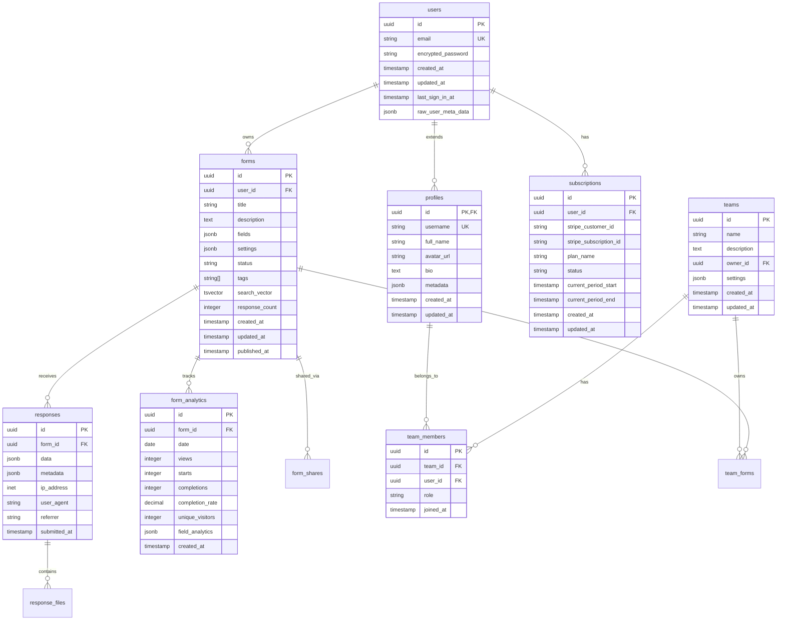

# 🗄️ Database Schema e Design
## YouForm - SaaS de Formulários Web

### 🎯 Visão Geral do Banco de Dados

O YouForm utiliza **PostgreSQL** via Supabase como banco principal, aproveitando recursos avançados como Row Level Security (RLS), Full-text Search, JSONB, e extensões especializadas para máxima performance e segurança.

### 📊 Diagrama Entidade-Relacionamento (ERD)



### 🏗️ Schema Completo

#### 1. Extensões e Configurações Iniciais

```sql
-- Habilitar extensões necessárias
CREATE EXTENSION IF NOT EXISTS "uuid-ossp";
CREATE EXTENSION IF NOT EXISTS "pgcrypto";
CREATE EXTENSION IF NOT EXISTS "pg_trgm";        -- Busca fuzzy
CREATE EXTENSION IF NOT EXISTS "unaccent";       -- Busca sem acentos
CREATE EXTENSION IF NOT EXISTS "pg_stat_statements"; -- Query analytics
CREATE EXTENSION IF NOT EXISTS "timescaledb" CASCADE; -- Time-series (futuro)

-- Configurações de performance
ALTER SYSTEM SET shared_preload_libraries = 'pg_stat_statements,timescaledb';
ALTER SYSTEM SET max_connections = 200;
ALTER SYSTEM SET shared_buffers = '256MB';
ALTER SYSTEM SET effective_cache_size = '1GB';
ALTER SYSTEM SET work_mem = '4MB';
ALTER SYSTEM SET maintenance_work_mem = '64MB';

-- Configurar timezone
SET timezone = 'UTC';
```

#### 2. Tabelas Principais

**Profiles (Extensão de auth.users)**
```sql
-- Tabela de perfis de usuário
CREATE TABLE public.profiles (
    id UUID PRIMARY KEY REFERENCES auth.users(id) ON DELETE CASCADE,
    username TEXT UNIQUE,
    full_name TEXT,
    avatar_url TEXT,
    bio TEXT,
    metadata JSONB DEFAULT '{}',
    created_at TIMESTAMPTZ DEFAULT NOW(),
    updated_at TIMESTAMPTZ DEFAULT NOW(),
    
    -- Constraints
    CONSTRAINT username_length CHECK (char_length(username) >= 3 AND char_length(username) <= 30),
    CONSTRAINT username_format CHECK (username ~ '^[a-zA-Z0-9_-]+$'),
    CONSTRAINT full_name_length CHECK (char_length(full_name) <= 100),
    CONSTRAINT bio_length CHECK (char_length(bio) <= 500)
);

-- Índices para performance
CREATE INDEX idx_profiles_username ON profiles(username);
CREATE INDEX idx_profiles_full_name_trgm ON profiles USING gin(full_name gin_trgm_ops);
CREATE INDEX idx_profiles_created_at ON profiles(created_at DESC);

-- Trigger para updated_at
CREATE TRIGGER update_profiles_updated_at
    BEFORE UPDATE ON profiles
    FOR EACH ROW
    EXECUTE FUNCTION update_updated_at();
```

**Forms (Tabela Principal)**
```sql
-- Tabela de formulários
CREATE TABLE public.forms (
    id UUID PRIMARY KEY DEFAULT uuid_generate_v4(),
    user_id UUID NOT NULL REFERENCES auth.users(id) ON DELETE CASCADE,
    title TEXT NOT NULL,
    description TEXT,
    fields JSONB NOT NULL DEFAULT '[]',
    settings JSONB NOT NULL DEFAULT '{}',
    status TEXT NOT NULL DEFAULT 'draft' CHECK (status IN ('draft', 'published', 'archived', 'deleted')),
    tags TEXT[] DEFAULT '{}',
    search_vector TSVECTOR,
    response_count INTEGER DEFAULT 0,
    view_count INTEGER DEFAULT 0,
    created_at TIMESTAMPTZ DEFAULT NOW(),
    updated_at TIMESTAMPTZ DEFAULT NOW(),
    published_at TIMESTAMPTZ,
    
    -- Constraints
    CONSTRAINT title_length CHECK (char_length(title) >= 1 AND char_length(title) <= 200),
    CONSTRAINT description_length CHECK (char_length(description) <= 1000),
    CONSTRAINT fields_is_array CHECK (jsonb_typeof(fields) = 'array'),
    CONSTRAINT settings_is_object CHECK (jsonb_typeof(settings) = 'object'),
    CONSTRAINT tags_limit CHECK (array_length(tags, 1) <= 20)
);

-- Índices otimizados
CREATE INDEX idx_forms_user_id ON forms(user_id);
CREATE INDEX idx_forms_status ON forms(status) WHERE status != 'deleted';
CREATE INDEX idx_forms_user_status ON forms(user_id, status) WHERE status != 'deleted';
CREATE INDEX idx_forms_created_at ON forms(created_at DESC);
CREATE INDEX idx_forms_updated_at ON forms(updated_at DESC);
CREATE INDEX idx_forms_published_at ON forms(published_at DESC) WHERE published_at IS NOT NULL;
CREATE INDEX idx_forms_tags ON forms USING gin(tags);
CREATE INDEX idx_forms_search ON forms USING gin(search_vector);
CREATE INDEX idx_forms_response_count ON forms(response_count DESC);

-- Índice composto para dashboard
CREATE INDEX idx_forms_dashboard ON forms(user_id, status, updated_at DESC) 
    WHERE status IN ('draft', 'published');

-- Trigger para search_vector
CREATE OR REPLACE FUNCTION forms_search_trigger() RETURNS trigger AS $$
BEGIN
    NEW.search_vector := 
        setweight(to_tsvector('portuguese', COALESCE(NEW.title, '')), 'A') ||
        setweight(to_tsvector('portuguese', COALESCE(NEW.description, '')), 'B') ||
        setweight(to_tsvector('portuguese', COALESCE(array_to_string(NEW.tags, ' '), '')), 'C');
    RETURN NEW;
END;
$$ LANGUAGE plpgsql;

CREATE TRIGGER update_forms_search
    BEFORE INSERT OR UPDATE ON forms
    FOR EACH ROW
    EXECUTE FUNCTION forms_search_trigger();

-- Trigger para published_at
CREATE OR REPLACE FUNCTION forms_published_trigger() RETURNS trigger AS $$
BEGIN
    IF NEW.status = 'published' AND OLD.status != 'published' THEN
        NEW.published_at = NOW();
    ELSIF NEW.status != 'published' THEN
        NEW.published_at = NULL;
    END IF;
    RETURN NEW;
END;
$$ LANGUAGE plpgsql;

CREATE TRIGGER update_forms_published
    BEFORE UPDATE ON forms
    FOR EACH ROW
    EXECUTE FUNCTION forms_published_trigger();
```

**Responses (Respostas dos Formulários)**
```sql
-- Tabela de respostas
CREATE TABLE public.responses (
    id UUID PRIMARY KEY DEFAULT uuid_generate_v4(),
    form_id UUID NOT NULL REFERENCES forms(id) ON DELETE CASCADE,
    data JSONB NOT NULL,
    metadata JSONB DEFAULT '{}',
    ip_address INET,
    user_agent TEXT,
    referrer TEXT,
    country_code CHAR(2),
    city TEXT,
    submitted_at TIMESTAMPTZ DEFAULT NOW(),
    
    -- Constraints
    CONSTRAINT data_is_object CHECK (jsonb_typeof(data) = 'object'),
    CONSTRAINT metadata_is_object CHECK (jsonb_typeof(metadata) = 'object'),
    CONSTRAINT user_agent_length CHECK (char_length(user_agent) <= 500),
    CONSTRAINT referrer_length CHECK (char_length(referrer) <= 500)
);

-- Índices para performance
CREATE INDEX idx_responses_form_id ON responses(form_id);
CREATE INDEX idx_responses_submitted_at ON responses(submitted_at DESC);
CREATE INDEX idx_responses_form_submitted ON responses(form_id, submitted_at DESC);
CREATE INDEX idx_responses_ip_address ON responses(ip_address);
CREATE INDEX idx_responses_country ON responses(country_code) WHERE country_code IS NOT NULL;

-- Índice para analytics por período
CREATE INDEX idx_responses_form_date ON responses(form_id, DATE(submitted_at));

-- Particionamento por mês (para escala futura)
-- CREATE TABLE responses_2025_01 PARTITION OF responses
--     FOR VALUES FROM ('2025-01-01') TO ('2025-02-01');

-- Trigger para incrementar response_count
CREATE OR REPLACE FUNCTION increment_form_response_count() RETURNS trigger AS $$
BEGIN
    UPDATE forms 
    SET response_count = response_count + 1,
        updated_at = NOW()
    WHERE id = NEW.form_id;
    RETURN NEW;
END;
$$ LANGUAGE plpgsql;

CREATE TRIGGER increment_response_count
    AFTER INSERT ON responses
    FOR EACH ROW
    EXECUTE FUNCTION increment_form_response_count();
```

**Form Analytics (Métricas Detalhadas)**
```sql
-- Tabela de analytics por formulário
CREATE TABLE public.form_analytics (
    id UUID PRIMARY KEY DEFAULT uuid_generate_v4(),
    form_id UUID NOT NULL REFERENCES forms(id) ON DELETE CASCADE,
    date DATE NOT NULL,
    views INTEGER DEFAULT 0,
    starts INTEGER DEFAULT 0,
    completions INTEGER DEFAULT 0,
    completion_rate DECIMAL(5,2) GENERATED ALWAYS AS (
        CASE WHEN starts > 0 THEN (completions::decimal / starts * 100) ELSE 0 END
    ) STORED,
    unique_visitors INTEGER DEFAULT 0,
    bounce_rate DECIMAL(5,2) DEFAULT 0,
    avg_completion_time INTERVAL,
    field_analytics JSONB DEFAULT '{}',
    traffic_sources JSONB DEFAULT '{}',
    device_analytics JSONB DEFAULT '{}',
    created_at TIMESTAMPTZ DEFAULT NOW(),
    updated_at TIMESTAMPTZ DEFAULT NOW(),
    
    -- Constraint para unicidade por form/data
    UNIQUE(form_id, date)
);

-- Índices para analytics
CREATE INDEX idx_analytics_form_id ON form_analytics(form_id);
CREATE INDEX idx_analytics_date ON form_analytics(date DESC);
CREATE INDEX idx_analytics_form_date ON form_analytics(form_id, date DESC);
CREATE INDEX idx_analytics_completion_rate ON form_analytics(completion_rate DESC);

-- Índice para agregações
CREATE INDEX idx_analytics_aggregation ON form_analytics(form_id, date) 
    INCLUDE (views, starts, completions, unique_visitors);
```

**Subscriptions (Assinaturas)**
```sql
-- Tabela de assinaturas
CREATE TABLE public.subscriptions (
    id UUID PRIMARY KEY DEFAULT uuid_generate_v4(),
    user_id UUID NOT NULL REFERENCES auth.users(id) ON DELETE CASCADE,
    stripe_customer_id TEXT UNIQUE,
    stripe_subscription_id TEXT UNIQUE,
    plan_name TEXT NOT NULL,
    status TEXT NOT NULL CHECK (status IN ('active', 'canceled', 'past_due', 'unpaid', 'trialing')),
    current_period_start TIMESTAMPTZ NOT NULL,
    current_period_end TIMESTAMPTZ NOT NULL,
    cancel_at_period_end BOOLEAN DEFAULT FALSE,
    canceled_at TIMESTAMPTZ,
    trial_start TIMESTAMPTZ,
    trial_end TIMESTAMPTZ,
    metadata JSONB DEFAULT '{}',
    created_at TIMESTAMPTZ DEFAULT NOW(),
    updated_at TIMESTAMPTZ DEFAULT NOW(),
    
    -- Constraints
    CONSTRAINT valid_period CHECK (current_period_end > current_period_start),
    CONSTRAINT valid_trial CHECK (trial_end IS NULL OR trial_end > trial_start)
);

-- Índices para subscriptions
CREATE INDEX idx_subscriptions_user_id ON subscriptions(user_id);
CREATE INDEX idx_subscriptions_status ON subscriptions(status);
CREATE INDEX idx_subscriptions_stripe_customer ON subscriptions(stripe_customer_id);
CREATE INDEX idx_subscriptions_period_end ON subscriptions(current_period_end) 
    WHERE status = 'active';

-- Índice para billing
CREATE INDEX idx_subscriptions_billing ON subscriptions(status, current_period_end) 
    WHERE status IN ('active', 'trialing');
```

#### 3. Tabelas de Colaboração (Teams)

**Teams**
```sql
-- Tabela de equipes
CREATE TABLE public.teams (
    id UUID PRIMARY KEY DEFAULT uuid_generate_v4(),
    name TEXT NOT NULL,
    description TEXT,
    owner_id UUID NOT NULL REFERENCES auth.users(id) ON DELETE CASCADE,
    settings JSONB DEFAULT '{}',
    created_at TIMESTAMPTZ DEFAULT NOW(),
    updated_at TIMESTAMPTZ DEFAULT NOW(),
    
    -- Constraints
    CONSTRAINT name_length CHECK (char_length(name) >= 2 AND char_length(name) <= 100),
    CONSTRAINT description_length CHECK (char_length(description) <= 500)
);

-- Team Members
CREATE TABLE public.team_members (
    id UUID PRIMARY KEY DEFAULT uuid_generate_v4(),
    team_id UUID NOT NULL REFERENCES teams(id) ON DELETE CASCADE,
    user_id UUID NOT NULL REFERENCES auth.users(id) ON DELETE CASCADE,
    role TEXT NOT NULL DEFAULT 'member' CHECK (role IN ('owner', 'admin', 'editor', 'viewer')),
    permissions JSONB DEFAULT '{}',
    joined_at TIMESTAMPTZ DEFAULT NOW(),
    
    -- Constraint de unicidade
    UNIQUE(team_id, user_id)
);

-- Team Forms (Formulários compartilhados)
CREATE TABLE public.team_forms (
    id UUID PRIMARY KEY DEFAULT uuid_generate_v4(),
    team_id UUID NOT NULL REFERENCES teams(id) ON DELETE CASCADE,
    form_id UUID NOT NULL REFERENCES forms(id) ON DELETE CASCADE,
    shared_by UUID NOT NULL REFERENCES auth.users(id) ON DELETE CASCADE,
    permissions JSONB DEFAULT '{}',
    shared_at TIMESTAMPTZ DEFAULT NOW(),
    
    -- Constraint de unicidade
    UNIQUE(team_id, form_id)
);

-- Índices para teams
CREATE INDEX idx_teams_owner_id ON teams(owner_id);
CREATE INDEX idx_team_members_team_id ON team_members(team_id);
CREATE INDEX idx_team_members_user_id ON team_members(user_id);
CREATE INDEX idx_team_forms_team_id ON team_forms(team_id);
CREATE INDEX idx_team_forms_form_id ON team_forms(form_id);
```

#### 4. Tabelas Auxiliares

**Response Files (Arquivos Anexados)**
```sql
-- Tabela para arquivos anexados às respostas
CREATE TABLE public.response_files (
    id UUID PRIMARY KEY DEFAULT uuid_generate_v4(),
    response_id UUID NOT NULL REFERENCES responses(id) ON DELETE CASCADE,
    field_id TEXT NOT NULL,
    filename TEXT NOT NULL,
    original_filename TEXT NOT NULL,
    mime_type TEXT NOT NULL,
    file_size BIGINT NOT NULL,
    storage_path TEXT NOT NULL,
    uploaded_at TIMESTAMPTZ DEFAULT NOW(),
    
    -- Constraints
    CONSTRAINT filename_length CHECK (char_length(filename) <= 255),
    CONSTRAINT file_size_limit CHECK (file_size <= 10485760), -- 10MB
    CONSTRAINT valid_mime_type CHECK (mime_type ~ '^[a-z]+/[a-z0-9\-\+\.]+$')
);

-- Índices para files
CREATE INDEX idx_response_files_response_id ON response_files(response_id);
CREATE INDEX idx_response_files_uploaded_at ON response_files(uploaded_at DESC);
```

**Form Shares (Compartilhamentos Públicos)**
```sql
-- Tabela para links de compartilhamento
CREATE TABLE public.form_shares (
    id UUID PRIMARY KEY DEFAULT uuid_generate_v4(),
    form_id UUID NOT NULL REFERENCES forms(id) ON DELETE CASCADE,
    share_token TEXT UNIQUE NOT NULL DEFAULT encode(gen_random_bytes(32), 'base64url'),
    password_hash TEXT,
    expires_at TIMESTAMPTZ,
    max_responses INTEGER,
    current_responses INTEGER DEFAULT 0,
    settings JSONB DEFAULT '{}',
    created_at TIMESTAMPTZ DEFAULT NOW(),
    
    -- Constraints
    CONSTRAINT valid_expiry CHECK (expires_at IS NULL OR expires_at > created_at),
    CONSTRAINT valid_max_responses CHECK (max_responses IS NULL OR max_responses > 0)
);

-- Índices para shares
CREATE INDEX idx_form_shares_form_id ON form_shares(form_id);
CREATE INDEX idx_form_shares_token ON form_shares(share_token);
CREATE INDEX idx_form_shares_expires ON form_shares(expires_at) WHERE expires_at IS NOT NULL;
```

### 🔐 Row Level Security (RLS)

#### Políticas de Segurança

```sql
-- Habilitar RLS em todas as tabelas
ALTER TABLE profiles ENABLE ROW LEVEL SECURITY;
ALTER TABLE forms ENABLE ROW LEVEL SECURITY;
ALTER TABLE responses ENABLE ROW LEVEL SECURITY;
ALTER TABLE form_analytics ENABLE ROW LEVEL SECURITY;
ALTER TABLE subscriptions ENABLE ROW LEVEL SECURITY;
ALTER TABLE teams ENABLE ROW LEVEL SECURITY;
ALTER TABLE team_members ENABLE ROW LEVEL SECURITY;
ALTER TABLE team_forms ENABLE ROW LEVEL SECURITY;
ALTER TABLE response_files ENABLE ROW LEVEL SECURITY;
ALTER TABLE form_shares ENABLE ROW LEVEL SECURITY;

-- Políticas para Profiles
CREATE POLICY "Public profiles are viewable by everyone" 
    ON profiles FOR SELECT 
    USING (true);

CREATE POLICY "Users can update own profile" 
    ON profiles FOR UPDATE 
    USING (auth.uid() = id);

CREATE POLICY "Users can insert own profile" 
    ON profiles FOR INSERT 
    WITH CHECK (auth.uid() = id);

-- Políticas para Forms
CREATE POLICY "Users can view own forms" 
    ON forms FOR SELECT 
    USING (
        auth.uid() = user_id 
        OR 
        EXISTS (
            SELECT 1 FROM team_forms tf
            JOIN team_members tm ON tf.team_id = tm.team_id
            WHERE tf.form_id = forms.id AND tm.user_id = auth.uid()
        )
    );

CREATE POLICY "Users can create forms" 
    ON forms FOR INSERT 
    WITH CHECK (auth.uid() = user_id);

CREATE POLICY "Users can update own forms" 
    ON forms FOR UPDATE 
    USING (
        auth.uid() = user_id 
        OR 
        EXISTS (
            SELECT 1 FROM team_forms tf
            JOIN team_members tm ON tf.team_id = tm.team_id
            WHERE tf.form_id = forms.id 
            AND tm.user_id = auth.uid() 
            AND tm.role IN ('owner', 'admin', 'editor')
        )
    );

CREATE POLICY "Users can delete own forms" 
    ON forms FOR DELETE 
    USING (auth.uid() = user_id);

-- Política especial para formulários públicos
CREATE POLICY "Published forms are publicly readable" 
    ON forms FOR SELECT 
    USING (status = 'published');

-- Políticas para Responses
CREATE POLICY "Form owners can view responses" 
    ON responses FOR SELECT 
    USING (
        EXISTS (
            SELECT 1 FROM forms 
            WHERE forms.id = responses.form_id 
            AND forms.user_id = auth.uid()
        )
        OR
        EXISTS (
            SELECT 1 FROM forms f
            JOIN team_forms tf ON f.id = tf.form_id
            JOIN team_members tm ON tf.team_id = tm.team_id
            WHERE f.id = responses.form_id 
            AND tm.user_id = auth.uid()
        )
    );

CREATE POLICY "Anyone can submit responses to published forms" 
    ON responses FOR INSERT 
    WITH CHECK (
        EXISTS (
            SELECT 1 FROM forms 
            WHERE forms.id = responses.form_id 
            AND forms.status = 'published'
        )
    );

-- Políticas para Analytics
CREATE POLICY "Form owners can view analytics" 
    ON form_analytics FOR SELECT 
    USING (
        EXISTS (
            SELECT 1 FROM forms 
            WHERE forms.id = form_analytics.form_id 
            AND forms.user_id = auth.uid()
        )
    );

-- Políticas para Subscriptions
CREATE POLICY "Users can view own subscriptions" 
    ON subscriptions FOR SELECT 
    USING (auth.uid() = user_id);

CREATE POLICY "Users can update own subscriptions" 
    ON subscriptions FOR UPDATE 
    USING (auth.uid() = user_id);

-- Políticas para Teams
CREATE POLICY "Team members can view team" 
    ON teams FOR SELECT 
    USING (
        EXISTS (
            SELECT 1 FROM team_members 
            WHERE team_members.team_id = teams.id 
            AND team_members.user_id = auth.uid()
        )
    );

CREATE POLICY "Team owners can update team" 
    ON teams FOR UPDATE 
    USING (auth.uid() = owner_id);

-- Políticas para Team Members
CREATE POLICY "Team members can view team members" 
    ON team_members FOR SELECT 
    USING (
        EXISTS (
            SELECT 1 FROM team_members tm 
            WHERE tm.team_id = team_members.team_id 
            AND tm.user_id = auth.uid()
        )
    );
```

### ⚡ Functions e Procedures

#### Functions Utilitárias

```sql
-- Function: Update updated_at timestamp
CREATE OR REPLACE FUNCTION update_updated_at()
RETURNS TRIGGER AS $$
BEGIN
    NEW.updated_at = NOW();
    RETURN NEW;
END;
$$ LANGUAGE plpgsql;

-- Aplicar trigger em todas as tabelas relevantes
CREATE TRIGGER update_profiles_updated_at
    BEFORE UPDATE ON profiles
    FOR EACH ROW
    EXECUTE FUNCTION update_updated_at();

CREATE TRIGGER update_forms_updated_at
    BEFORE UPDATE ON forms
    FOR EACH ROW
    EXECUTE FUNCTION update_updated_at();

CREATE TRIGGER update_subscriptions_updated_at
    BEFORE UPDATE ON subscriptions
    FOR EACH ROW
    EXECUTE FUNCTION update_updated_at();

CREATE TRIGGER update_teams_updated_at
    BEFORE UPDATE ON teams
    FOR EACH ROW
    EXECUTE FUNCTION update_updated_at();
```

#### Functions de Busca

```sql
-- Function: Busca avançada de formulários
CREATE OR REPLACE FUNCTION search_forms(
    search_query TEXT,
    user_uuid UUID,
    form_status TEXT DEFAULT NULL,
    limit_count INTEGER DEFAULT 20,
    offset_count INTEGER DEFAULT 0
)
RETURNS TABLE (
    id UUID,
    title TEXT,
    description TEXT,
    status TEXT,
    response_count INTEGER,
    created_at TIMESTAMPTZ,
    updated_at TIMESTAMPTZ,
    rank REAL
) AS $$
BEGIN
    RETURN QUERY
    SELECT 
        f.id,
        f.title,
        f.description,
        f.status,
        f.response_count,
        f.created_at,
        f.updated_at,
        ts_rank(f.search_vector, plainto_tsquery('portuguese', search_query)) as rank
    FROM forms f
    WHERE f.user_id = user_uuid
    AND (form_status IS NULL OR f.status = form_status)
    AND (
        f.search_vector @@ plainto_tsquery('portuguese', search_query)
        OR f.title ILIKE '%' || search_query || '%'
        OR f.description ILIKE '%' || search_query || '%'
    )
    ORDER BY rank DESC, f.updated_at DESC
    LIMIT limit_count
    OFFSET offset_count;
END;
$$ LANGUAGE plpgsql SECURITY DEFINER;
```

#### Functions de Analytics

```sql
-- Function: Estatísticas do usuário
CREATE OR REPLACE FUNCTION get_user_stats(user_uuid UUID)
RETURNS TABLE (
    total_forms BIGINT,
    published_forms BIGINT,
    draft_forms BIGINT,
    total_responses BIGINT,
    total_views BIGINT,
    avg_completion_rate DECIMAL,
    most_popular_form_id UUID,
    recent_activity JSONB
) AS $$
BEGIN
    RETURN QUERY
    SELECT 
        COUNT(*) FILTER (WHERE status != 'deleted') as total_forms,
        COUNT(*) FILTER (WHERE status = 'published') as published_forms,
        COUNT(*) FILTER (WHERE status = 'draft') as draft_forms,
        COALESCE(SUM(response_count), 0) as total_responses,
        COALESCE(SUM(view_count), 0) as total_views,
        COALESCE(AVG(
            CASE 
                WHEN view_count > 0 THEN (response_count::decimal / view_count * 100)
                ELSE 0 
            END
        ), 0) as avg_completion_rate,
        (
            SELECT id FROM forms 
            WHERE user_id = user_uuid AND status = 'published'
            ORDER BY response_count DESC 
            LIMIT 1
        ) as most_popular_form_id,
        (
            SELECT jsonb_agg(
                jsonb_build_object(
                    'form_id', id,
                    'title', title,
                    'responses_today', (
                        SELECT COUNT(*) FROM responses 
                        WHERE form_id = forms.id 
                        AND submitted_at >= CURRENT_DATE
                    )
                )
            )
            FROM forms 
            WHERE user_id = user_uuid 
            AND status = 'published'
            ORDER BY updated_at DESC 
            LIMIT 5
        ) as recent_activity
    FROM forms
    WHERE user_id = user_uuid;
END;
$$ LANGUAGE plpgsql SECURITY DEFINER;

-- Function: Analytics de formulário por período
CREATE OR REPLACE FUNCTION get_form_analytics(
    form_uuid UUID,
    start_date DATE,
    end_date DATE
)
RETURNS TABLE (
    date DATE,
    views INTEGER,
    starts INTEGER,
    completions INTEGER,
    completion_rate DECIMAL,
    unique_visitors INTEGER
) AS $$
BEGIN
    RETURN QUERY
    SELECT 
        fa.date,
        fa.views,
        fa.starts,
        fa.completions,
        fa.completion_rate,
        fa.unique_visitors
    FROM form_analytics fa
    WHERE fa.form_id = form_uuid
    AND fa.date BETWEEN start_date AND end_date
    ORDER BY fa.date DESC;
END;
$$ LANGUAGE plpgsql SECURITY DEFINER;
```

### 📈 Otimizações de Performance

#### Índices Especializados

```sql
-- Índices para queries frequentes
CREATE INDEX CONCURRENTLY idx_forms_user_updated_published 
    ON forms(user_id, updated_at DESC) 
    WHERE status IN ('published', 'draft');

CREATE INDEX CONCURRENTLY idx_responses_form_recent 
    ON responses(form_id, submitted_at DESC) 
    WHERE submitted_at >= CURRENT_DATE - INTERVAL '30 days';

-- Índice parcial para formulários ativos
CREATE INDEX CONCURRENTLY idx_forms_active 
    ON forms(user_id, response_count DESC, updated_at DESC) 
    WHERE status = 'published' AND response_count > 0;

-- Índice para analytics agregadas
CREATE INDEX CONCURRENTLY idx_analytics_monthly 
    ON form_analytics(form_id, DATE_TRUNC('month', date)) 
    INCLUDE (views, starts, completions);
```

#### Particionamento (Preparação para Escala)

```sql
-- Preparar particionamento para responses (quando necessário)
-- ALTER TABLE responses RENAME TO responses_template;

-- CREATE TABLE responses (
--     LIKE responses_template INCLUDING ALL
-- ) PARTITION BY RANGE (submitted_at);

-- -- Criar partições mensais
-- CREATE TABLE responses_2025_01 PARTITION OF responses
--     FOR VALUES FROM ('2025-01-01') TO ('2025-02-01');

-- CREATE TABLE responses_2025_02 PARTITION OF responses
--     FOR VALUES FROM ('2025-02-01') TO ('2025-03-01');
```

#### Materialized Views para Analytics

```sql
-- View materializada para dashboard
CREATE MATERIALIZED VIEW dashboard_stats AS
SELECT 
    f.user_id,
    COUNT(*) as total_forms,
    COUNT(*) FILTER (WHERE f.status = 'published') as published_forms,
    SUM(f.response_count) as total_responses,
    SUM(f.view_count) as total_views,
    AVG(
        CASE 
            WHEN f.view_count > 0 THEN (f.response_count::decimal / f.view_count * 100)
            ELSE 0 
        END
    ) as avg_completion_rate,
    MAX(f.updated_at) as last_activity
FROM forms f
WHERE f.status != 'deleted'
GROUP BY f.user_id;

-- Índice na view materializada
CREATE UNIQUE INDEX idx_dashboard_stats_user ON dashboard_stats(user_id);

-- Refresh automático (via cron job)
-- SELECT cron.schedule('refresh-dashboard-stats', '*/15 * * * *', 'REFRESH MATERIALIZED VIEW CONCURRENTLY dashboard_stats;');
```

### 🔄 Backup e Manutenção

#### Estratégia de Backup

```sql
-- Configurar backup automático (via Supabase CLI)
-- supabase db dump --db-url $DATABASE