# 🛡️ Security Overview
## YouForm - SaaS de Formulários Web

### 🎯 Filosofia de Segurança

A segurança no YouForm é construída com base no princípio de **"Security by Design"**, onde cada componente é desenvolvido com segurança como prioridade desde o início, não como uma adição posterior.

### 🏛️ Arquitetura de Segurança

#### Modelo de Segurança em Camadas

```mermaid
graph TB
    subgraph "Camada 1: Perímetro"
        WAF[🛡️ Web Application Firewall]
        DDoS[⚡ DDoS Protection]
        CDN[🌍 CDN Security]
    end
    
    subgraph "Camada 2: Aplicação"
        AUTH[🔐 Authentication]
        AUTHZ[🔑 Authorization]
        RATE[⏱️ Rate Limiting]
        INPUT[🔍 Input Validation]
    end
    
    subgraph "Camada 3: Dados"
        ENCRYPT[🔒 Encryption at Rest]
        TRANSIT[🚀 Encryption in Transit]
        RLS[🔐 Row Level Security]
        BACKUP[💾 Secure Backups]
    end
    
    subgraph "Camada 4: Infraestrutura"
        VPC[🏠 Private Networks]
        MONITOR[👁️ Security Monitoring]
        AUDIT[📋 Audit Logging]
        INCIDENT[🚨 Incident Response]
    end
    
    WAF --> AUTH
    DDoS --> AUTHZ
    CDN --> RATE
    AUTH --> ENCRYPT
    AUTHZ --> TRANSIT
    RATE --> RLS
    INPUT --> BACKUP
    ENCRYPT --> VPC
    TRANSIT --> MONITOR
    RLS --> AUDIT
    BACKUP --> INCIDENT
```



### 🔐 Autenticação e Autorização

#### Sistema de Autenticação Multi-Camada

**1. Autenticação Primária**
```typescript
// JWT Token Structure
interface JWTPayload {
  sub: string;           // User ID
  email: string;         // User email
  role: UserRole;        // User role
  permissions: string[]; // Specific permissions
  iat: number;          // Issued at
  exp: number;          // Expires at
  jti: string;          // JWT ID (for revocation)
}

// Token Validation Flow
async function validateToken(token: string): Promise<User | null> {
  try {
    // 1. Verify signature
    const payload = jwt.verify(token, JWT_SECRET) as JWTPayload;
    
    // 2. Check expiration
    if (payload.exp < Date.now() / 1000) {
      throw new Error('Token expired');
    }
    
    // 3. Check revocation list
    const isRevoked = await redis.get(`revoked:${payload.jti}`);
    if (isRevoked) {
      throw new Error('Token revoked');
    }
    
    // 4. Validate user exists and is active
    const user = await getUserById(payload.sub);
    if (!user || !user.isActive) {
      throw new Error('User not found or inactive');
    }
    
    return user;
  } catch (error) {
    logger.warn('Token validation failed', { error: error.message });
    return null;
  }
}
```

**2. Refresh Token Strategy**
```typescript
// Secure refresh token implementation
interface RefreshToken {
  id: string;
  userId: string;
  tokenHash: string;     // Hashed version of token
  expiresAt: Date;
  createdAt: Date;
  lastUsedAt: Date;
  deviceInfo: string;    // Device fingerprint
  ipAddress: string;     // IP address
  isRevoked: boolean;
}

// Refresh token rotation
async function refreshAccessToken(refreshToken: string): Promise<AuthTokens> {
  // 1. Validate refresh token
  const tokenRecord = await validateRefreshToken(refreshToken);
  
  // 2. Generate new token pair
  const newTokens = await generateTokenPair(tokenRecord.userId);
  
  // 3. Revoke old refresh token
  await revokeRefreshToken(tokenRecord.id);
  
  // 4. Store new refresh token
  await storeRefreshToken(newTokens.refreshToken, tokenRecord.userId);
  
  return newTokens;
}
```

**3. Multi-Factor Authentication (MFA)**
```typescript
// TOTP-based MFA implementation
interface MFASetup {
  userId: string;
  secret: string;        // Base32 encoded secret
  backupCodes: string[]; // One-time backup codes
  isEnabled: boolean;
  createdAt: Date;
}

// MFA verification
async function verifyMFA(userId: string, token: string): Promise<boolean> {
  const mfaSetup = await getMFASetup(userId);
  
  if (!mfaSetup?.isEnabled) {
    return true; // MFA not required
  }
  
  // Verify TOTP token
  const isValidTOTP = speakeasy.totp.verify({
    secret: mfaSetup.secret,
    encoding: 'base32',
    token: token,
    window: 2 // Allow 2 time steps tolerance
  });
  
  // Check backup codes if TOTP fails
  if (!isValidTOTP) {
    return await verifyBackupCode(userId, token);
  }
  
  return isValidTOTP;
}
```

#### Controle de Acesso Baseado em Roles (RBAC)

**Hierarquia de Roles:**
```typescript
enum UserRole {
  SUPER_ADMIN = 'super_admin',    // Platform administration
  ADMIN = 'admin',                // Organization admin
  EDITOR = 'editor',              // Can create/edit forms
  VIEWER = 'viewer',              // Read-only access
  RESPONDENT = 'respondent'       // Can only submit responses
}

// Permission matrix
const PERMISSIONS = {
  [UserRole.SUPER_ADMIN]: [
    'platform:manage',
    'users:manage',
    'forms:manage',
    'analytics:view',
    'billing:manage'
  ],
  [UserRole.ADMIN]: [
    'organization:manage',
    'users:invite',
    'forms:manage',
    'analytics:view',
    'billing:view'
  ],
  [UserRole.EDITOR]: [
    'forms:create',
    'forms:edit',
    'forms:delete',
    'responses:view',
    'analytics:view'
  ],
  [UserRole.VIEWER]: [
    'forms:view',
    'responses:view',
    'analytics:view'
  ],
  [UserRole.RESPONDENT]: [
    'responses:create'
  ]
};

// Permission check middleware
function requirePermission(permission: string) {
  return async (req: Request, res: Response, next: NextFunction) => {
    const user = req.user;
    
    if (!user) {
      return res.status(401).json({ error: 'Unauthorized' });
    }
    
    const userPermissions = PERMISSIONS[user.role] || [];
    
    if (!userPermissions.includes(permission)) {
      logger.warn('Permission denied', {
        userId: user.id,
        requiredPermission: permission,
        userRole: user.role
      });
      
      return res.status(403).json({ error: 'Forbidden' });
    }
    
    next();
  };
}
```

### 🔒 Criptografia e Proteção de Dados

#### Criptografia em Trânsito

**TLS/SSL Configuration:**
```nginx
# Nginx SSL configuration
server {
    listen 443 ssl http2;
    server_name youform.com;
    
    # SSL certificates
    ssl_certificate /path/to/certificate.crt;
    ssl_certificate_key /path/to/private.key;
    
    # SSL protocols and ciphers
    ssl_protocols TLSv1.2 TLSv1.3;
    ssl_ciphers ECDHE-RSA-AES256-GCM-SHA512:DHE-RSA-AES256-GCM-SHA512:ECDHE-RSA-AES256-GCM-SHA384;
    ssl_prefer_server_ciphers off;
    
    # HSTS
    add_header Strict-Transport-Security "max-age=63072000" always;
    
    # OCSP stapling
    ssl_stapling on;
    ssl_stapling_verify on;
    
    # Security headers
    add_header X-Frame-Options DENY;
    add_header X-Content-Type-Options nosniff;
    add_header X-XSS-Protection "1; mode=block";
    add_header Referrer-Policy "strict-origin-when-cross-origin";
    add_header Content-Security-Policy "default-src 'self'; script-src 'self' 'unsafe-inline'; style-src 'self' 'unsafe-inline'";
}
```

#### Criptografia em Repouso

**Database Encryption:**
```sql
-- Enable transparent data encryption
ALTER SYSTEM SET ssl = on;
ALTER SYSTEM SET ssl_cert_file = 'server.crt';
ALTER SYSTEM SET ssl_key_file = 'server.key';

-- Encrypt sensitive columns
CREATE EXTENSION IF NOT EXISTS pgcrypto;

-- Function to encrypt PII data
CREATE OR REPLACE FUNCTION encrypt_pii(data TEXT)
RETURNS TEXT AS $$
BEGIN
    RETURN encode(
        encrypt(
            data::bytea,
            current_setting('app.encryption_key')::bytea,
            'aes'
        ),
        'base64'
    );
END;
$$ LANGUAGE plpgsql SECURITY DEFINER;

-- Function to decrypt PII data
CREATE OR REPLACE FUNCTION decrypt_pii(encrypted_data TEXT)
RETURNS TEXT AS $$
BEGIN
    RETURN convert_from(
        decrypt(
            decode(encrypted_data, 'base64'),
            current_setting('app.encryption_key')::bytea,
            'aes'
        ),
        'UTF8'
    );
END;
$$ LANGUAGE plpgsql SECURITY DEFINER;
```

**Application-Level Encryption:**
```typescript
// Encryption service for sensitive data
class EncryptionService {
  private readonly algorithm = 'aes-256-gcm';
  private readonly keyDerivationIterations = 100000;
  
  async encrypt(plaintext: string, masterKey: string): Promise<EncryptedData> {
    // Generate random salt and IV
    const salt = crypto.randomBytes(32);
    const iv = crypto.randomBytes(16);
    
    // Derive key from master key and salt
    const key = crypto.pbkdf2Sync(masterKey, salt, this.keyDerivationIterations, 32, 'sha256');
    
    // Encrypt data
    const cipher = crypto.createCipher(this.algorithm, key);
    cipher.setAAD(Buffer.from('youform-aad'));
    
    let encrypted = cipher.update(plaintext, 'utf8', 'hex');
    encrypted += cipher.final('hex');
    
    const authTag = cipher.getAuthTag();
    
    return {
      encrypted,
      salt: salt.toString('hex'),
      iv: iv.toString('hex'),
      authTag: authTag.toString('hex')
    };
  }
  
  async decrypt(encryptedData: EncryptedData, masterKey: string): Promise<string> {
    // Derive key from master key and salt
    const key = crypto.pbkdf2Sync(
      masterKey,
      Buffer.from(encryptedData.salt, 'hex'),
      this.keyDerivationIterations,
      32,
      'sha256'
    );
    
    // Decrypt data
    const decipher = crypto.createDecipher(this.algorithm, key);
    decipher.setAAD(Buffer.from('youform-aad'));
    decipher.setAuthTag(Buffer.from(encryptedData.authTag, 'hex'));
    
    let decrypted = decipher.update(encryptedData.encrypted, 'hex', 'utf8');
    decrypted += decipher.final('utf8');
    
    return decrypted;
  }
}
```

### 🛡️ Proteção contra Vulnerabilidades

#### Input Validation e Sanitização

**Comprehensive Input Validation:**
```typescript
// Validation schemas using Zod
const FormFieldSchema = z.object({
  id: z.string().uuid(),
  type: z.enum(['text', 'email', 'number', 'select', 'textarea']),
  label: z.string().min(1).max(200).trim(),
  placeholder: z.string().max(100).optional(),
  required: z.boolean(),
  validation: z.array(ValidationRuleSchema).optional(),
  options: z.array(FieldOptionSchema).optional()
});

const CreateFormSchema = z.object({
  title: z.string().min(1).max(200).trim(),
  description: z.string().max(1000).optional(),
  fields: z.array(FormFieldSchema).min(1).max(50),
  settings: FormSettingsSchema
});

// Input sanitization
function sanitizeInput(input: string): string {
  return DOMPurify.sanitize(input, {
    ALLOWED_TAGS: ['b', 'i', 'em', 'strong', 'a', 'br'],
    ALLOWED_ATTR: ['href'],
    ALLOW_DATA_ATTR: false
  });
}

// SQL injection prevention
async function safeQuery(query: string, params: any[]): Promise<any> {
  // Use parameterized queries only
  return await db.query(query, params);
}
```

#### XSS Protection

**Content Security Policy:**
```typescript
// CSP configuration
const cspDirectives = {
  defaultSrc: ["'self'"],
  scriptSrc: [
    "'self'",
    "'unsafe-inline'", // Only for specific inline scripts
    "https://js.stripe.com",
    "https://www.google.com/recaptcha/",
    "https://www.gstatic.com/recaptcha/"
  ],
  styleSrc: [
    "'self'",
    "'unsafe-inline'", // For dynamic styles
    "https://fonts.googleapis.com"
  ],
  fontSrc: [
    "'self'",
    "https://fonts.gstatic.com"
  ],
  imgSrc: [
    "'self'",
    "data:",
    "https://youform.com",
    "https://*.youform.com"
  ],
  connectSrc: [
    "'self'",
    "https://api.youform.com",
    "https://analytics.youform.com"
  ],
  frameSrc: [
    "https://js.stripe.com",
    "https://www.google.com/recaptcha/"
  ]
};

// Apply CSP headers
app.use((req, res, next) => {
  const csp = Object.entries(cspDirectives)
    .map(([directive, sources]) => `${directive} ${sources.join(' ')}`)
    .join('; ');
    
  res.setHeader('Content-Security-Policy', csp);
  next();
});
```

#### CSRF Protection

**CSRF Token Implementation:**
```typescript
// CSRF token generation and validation
class CSRFProtection {
  private static readonly TOKEN_LENGTH = 32;
  
  static generateToken(sessionId: string): string {
    const timestamp = Date.now().toString();
    const random = crypto.randomBytes(16).toString('hex');
    const payload = `${sessionId}:${timestamp}:${random}`;
    
    const hmac = crypto.createHmac('sha256', process.env.CSRF_SECRET!);
    hmac.update(payload);
    const signature = hmac.digest('hex');
    
    return Buffer.from(`${payload}:${signature}`).toString('base64');
  }
  
  static validateToken(token: string, sessionId: string): boolean {
    try {
      const decoded = Buffer.from(token, 'base64').toString('utf8');
      const [session, timestamp, random, signature] = decoded.split(':');
      
      // Validate session
      if (session !== sessionId) return false;
      
      // Validate timestamp (token expires in 1 hour)
      const tokenTime = parseInt(timestamp);
      if (Date.now() - tokenTime > 3600000) return false;
      
      // Validate signature
      const payload = `${session}:${timestamp}:${random}`;
      const hmac = crypto.createHmac('sha256', process.env.CSRF_SECRET!);
      hmac.update(payload);
      const expectedSignature = hmac.digest('hex');
      
      return crypto.timingSafeEqual(
        Buffer.from(signature, 'hex'),
        Buffer.from(expectedSignature, 'hex')
      );
    } catch {
      return false;
    }
  }
}

// CSRF middleware
const csrfProtection = (req: Request, res: Response, next: NextFunction) => {
  if (['GET', 'HEAD', 'OPTIONS'].includes(req.method)) {
    return next();
  }
  
  const token = req.headers['x-csrf-token'] as string;
  const sessionId = req.session?.id;
  
  if (!token || !sessionId || !CSRFProtection.validateToken(token, sessionId)) {
    return res.status(403).json({ error: 'Invalid CSRF token' });
  }
  
  next();
};
```

### 🚨 Rate Limiting e DDoS Protection

#### Advanced Rate Limiting

**Multi-Tier Rate Limiting:**
```typescript
// Rate limiting configuration
const rateLimitConfig = {
  // Global limits
  global: {
    windowMs: 15 * 60 * 1000, // 15 minutes
    max: 1000, // requests per window
    message: 'Too many requests from this IP'
  },
  
  // Authentication endpoints
  auth: {
    windowMs: 15 * 60 * 1000,
    max: 5, // 5 login attempts per 15 minutes
    skipSuccessfulRequests: true,
    message: 'Too many login attempts'
  },
  
  // Form submission
  submission: {
    windowMs: 60 * 1000, // 1 minute
    max: 10, // 10 submissions per minute per IP
    message: 'Too many form submissions'
  },
  
  // API endpoints
  api: {
    windowMs: 60 * 1000,
    max: 100, // 100 API calls per minute
    message: 'API rate limit exceeded'
  }
};

// Distributed rate limiting with Redis
class DistributedRateLimit {
  constructor(private redis: Redis) {}
  
  async checkLimit(
    key: string,
    limit: number,
    windowMs: number
  ): Promise<{ allowed: boolean; remaining: number; resetTime: number }> {
    const now = Date.now();
    const window = Math.floor(now / windowMs);
    const redisKey = `rate_limit:${key}:${window}`;
    
    const current = await this.redis.incr(redisKey);
    
    if (current === 1) {
      await this.redis.expire(redisKey, Math.ceil(windowMs / 1000));
    }
    
    const remaining = Math.max(0, limit - current);
    const resetTime = (window + 1) * windowMs;
    
    return {
      allowed: current <= limit,
      remaining,
      resetTime
    };
  }
}
```

#### DDoS Protection Strategy

**Application-Level Protection:**
```typescript
// DDoS detection and mitigation
class DDoSProtection {
  private suspiciousIPs = new Map<string, SuspiciousActivity>();
  
  async analyzeRequest(req: Request): Promise<ThreatLevel> {
    const ip = this.getClientIP(req);
    const userAgent = req.headers['user-agent'];
    const referer = req.headers['referer'];
    
    // Analyze request patterns
    const patterns = await this.analyzePatterns(ip, {
      userAgent,
      referer,
      endpoint: req.path,
      method: req.method,
      timestamp: Date.now()
    });
    
    // Calculate threat score
    let threatScore = 0;
    
    // High request frequency
    if (patterns.requestsPerMinute > 100) threatScore += 30;
    
    // Suspicious user agent
    if (this.isSuspiciousUserAgent(userAgent)) threatScore += 20;
    
    // No referer on POST requests
    if (req.method === 'POST' && !referer) threatScore += 15;
    
    // Accessing only form endpoints
    if (patterns.endpointDiversity < 0.2) threatScore += 25;
    
    // Determine threat level
    if (threatScore >= 70) return ThreatLevel.HIGH;
    if (threatScore >= 40) return ThreatLevel.MEDIUM;
    if (threatScore >= 20) return ThreatLevel.LOW;
    
    return ThreatLevel.NONE;
  }
  
  async mitigateThreat(ip: string, level: ThreatLevel): Promise<void> {
    switch (level) {
      case ThreatLevel.HIGH:
        await this.blockIP(ip, 24 * 60 * 60); // 24 hours
        await this.notifySecurityTeam(ip, level);
        break;
        
      case ThreatLevel.MEDIUM:
        await this.challengeIP(ip); // Require CAPTCHA
        break;
        
      case ThreatLevel.LOW:
        await this.throttleIP(ip); // Reduce rate limits
        break;
    }
  }
}
```

### 🔍 Security Monitoring e Logging

#### Comprehensive Security Logging

**Security Event Logging:**
```typescript
// Security event types
enum SecurityEventType {
  LOGIN_SUCCESS = 'login_success',
  LOGIN_FAILURE = 'login_failure',
  PASSWORD_CHANGE = 'password_change',
  MFA_ENABLED = 'mfa_enabled',
  PERMISSION_DENIED = 'permission_denied',
  SUSPICIOUS_ACTIVITY = 'suspicious_activity',
  DATA_EXPORT = 'data_export',
  ADMIN_ACTION = 'admin_action'
}

// Security logger
class SecurityLogger {
  async logSecurityEvent(event: SecurityEvent): Promise<void> {
    const logEntry = {
      timestamp: new Date().toISOString(),
      eventType: event.type,
      userId: event.userId,
      ipAddress: event.ipAddress,
      userAgent: event.userAgent,
      details: event.details,
      severity: event.severity,
      sessionId: event.sessionId
    };
    
    // Log to multiple destinations
    await Promise.all([
      this.logToFile(logEntry),
      this.logToDatabase(logEntry),
      this.logToSIEM(logEntry)
    ]);
    
    // Alert on high severity events
    if (event.severity === 'HIGH') {
      await this.sendSecurityAlert(logEntry);
    }
  }
  
  private async logToSIEM(logEntry: SecurityLogEntry): Promise<void> {
    // Send to Security Information and Event Management system
    await fetch(process.env.SIEM_ENDPOINT!, {
      method: 'POST',
      headers: {
        'Content-Type': 'application/json',
        'Authorization': `Bearer ${process.env.SIEM_TOKEN}`
      },
      body: JSON.stringify(logEntry)
    });
  }
}
```

#### Real-time Security Monitoring

**Anomaly Detection:**
```typescript
// Behavioral anomaly detection
class AnomalyDetector {
  async detectAnomalies(userId: string): Promise<Anomaly[]> {
    const user = await this.getUserProfile(userId);
    const recentActivity = await this.getRecentActivity(userId, 24); // Last 24 hours
    
    const anomalies: Anomaly[] = [];
    
    // Unusual login location
    const usualLocations = await this.getUserUsualLocations(userId);
    const currentLocation = await this.getCurrentLocation(userId);
    
    if (!this.isLocationFamiliar(currentLocation, usualLocations)) {
      anomalies.push({
        type: 'unusual_location',
        severity: 'MEDIUM',
        details: { currentLocation, usualLocations }
      });
    }
    
    // Unusual activity patterns
    const usualActivityPattern = await this.getUserActivityPattern(userId);
    const currentPattern = this.analyzeCurrentActivity(recentActivity);
    
    if (this.isPatternAnomalous(currentPattern, usualActivityPattern)) {
      anomalies.push({
        type: 'unusual_activity_pattern',
        severity: 'LOW',
        details: { currentPattern, usualPattern: usualActivityPattern }
      });
    }
    
    // Mass data access
    const dataAccessCount = recentActivity.filter(a => a.type === 'data_access').length;
    if (dataAccessCount > user.averageDataAccess * 3) {
      anomalies.push({
        type: 'mass_data_access',
        severity: 'HIGH',
        details: { accessCount: dataAccessCount, average: user.averageDataAccess }
      });
    }
    
    return anomalies;
  }
}
```

### 🔄 Incident Response

#### Automated Incident Response

**Incident Response Workflow:**
```typescript
// Incident response automation
class IncidentResponseSystem {
  async handleSecurityIncident(incident: SecurityIncident): Promise<void> {
    // 1. Immediate containment
    await this.containThreat(incident);
    
    // 2. Evidence collection
    const evidence = await this.collectEvidence(incident);
    
    // 3. Impact assessment
    const impact = await this.assessImpact(incident);
    
    // 4. Notification
    await this.notifyStakeholders(incident, impact);
    
    // 5. Recovery actions
    await this.initiateRecovery(incident);
    
    // 6. Documentation
    await this.documentIncident(incident, evidence, impact);
  }
  
  private async containThreat(incident: SecurityIncident): Promise<void> {
    switch (incident.type) {
      case 'account_compromise':
        await this.suspendUserAccount(incident.userId);
        await this.revokeAllSessions(incident.userId);
        break;
        
      case 'data_breach':
        await this.isolateAffectedSystems(incident.affectedSystems);
        await this.enableEmergencyMode();
        break;
        
      case 'ddos_attack':
        await this.activateDDoSMitigation(incident.sourceIPs);
        break;
    }
  }
  
  private async notifyStakeholders(
    incident: SecurityIncident,
    impact: ImpactAssessment
  ): Promise<void> {
    const notifications = [];
    
    // Internal notifications
    notifications.push(
      this.notifySecurityTeam(incident),
      this.notifyManagement(incident, impact)
    );
    
    // External notifications (if required)
    if (impact.requiresCustomerNotification) {
      notifications.push(this.notifyAffectedCustomers(incident, impact));
    }
    
    if (impact.requiresRegulatoryNotification) {
      notifications.push(this.notifyRegulators(incident, impact));
    }
    
    await Promise.all(notifications);
  }
}
```

### 📋 Security Compliance

#### LGPD/GDPR Compliance

**Data Protection Implementation:**
```typescript
// GDPR/LGPD compliance features
class DataProtectionService {
  // Right to be forgotten
  async deleteUserData(userId: string, reason: string): Promise<void> {
    const deletionRecord = {
      userId,
      requestedAt: new Date(),
      reason,
      status: 'in_progress'
    };
    
    await this.logDeletionRequest(deletionRecord);
    
    try {
      // Delete from all systems
      await Promise.all([
        this.deleteFromDatabase(userId),
        this.deleteFromBackups(userId),
        this.deleteFromAnalytics(userId),
        this.deleteFromLogs(userId)
      ]);
      
      deletionRecord.status = 'completed';
      deletionRecord.completedAt = new Date();
      
    } catch (error) {
      deletionRecord.status = 'failed';
      deletionRecord.error = error.message;
      throw error;
    } finally {
      await this.updateDeletionRecord(deletionRecord);
    }
  }
  
  // Data portability
  async exportUserData(userId: string): Promise<UserDataExport> {
    const userData = await this.collectUserData(userId);
    
    const exportData = {
      personalInfo: userData.profile,
      forms: userData.forms,
      responses: userData.responses,
      analytics: userData.analytics,
      exportedAt: new Date(),
      format: 'JSON'
    };
    
    // Log export request
    await this.logDataExport(userId, exportData);
    
    return exportData;
  }
  
  // Consent management
  async updateConsent(userId: string, consents: ConsentUpdate[]): Promise<void> {
    for (const consent of consents) {
      await this.recordConsent({
        userId,
        consentType: consent.type,
        granted: consent.granted,
        timestamp: new Date(),
        ipAddress: consent.ipAddress,
        userAgent: consent.userAgent
      });
    }
    
    // Apply consent changes
    await this.applyConsentChanges(userId, consents);
  }
}
```

### 🔧 Security Configuration

#### Environment Security

**Production Security Checklist:**
```yaml
# Security configuration checklist
security_checklist:
  infrastructure:
    - name: "TLS 1.3 enabled"
      status: "✅ Implemented"
    - name: "HSTS headers configured"
      status: "✅ Implemented"
    - name: "Security headers (CSP, X-Frame-Options, etc.)"
      status: "✅ Implemented"
    - name: "WAF configured"
      status: "✅ Implemented"
    - name: "DDoS protection active"
      status: "✅ Implemented"
  
  application:
    - name: "Input validation on all endpoints"
      status: "✅ Implemented"
    - name: "SQL injection prevention"
      status: "✅ Implemented"
    - name: "XSS protection"
      status: "✅ Implemented"
    - name: "CSRF protection"
      status: "✅ Implemented"
    - name: "Rate limiting configured"
      status: "✅ Implemented"
  
  authentication:
    - name: "Strong password policy"
      status: "✅ Implemented"
    - name: "MFA available"
      status: "✅ Implemented"
    - name: "Session management secure"
      status: "✅ Implemented"
    - name: "JWT tokens properly secured"
      status: "✅ Implemented"
  
  data:
    - name: "Encryption at rest"
      status: