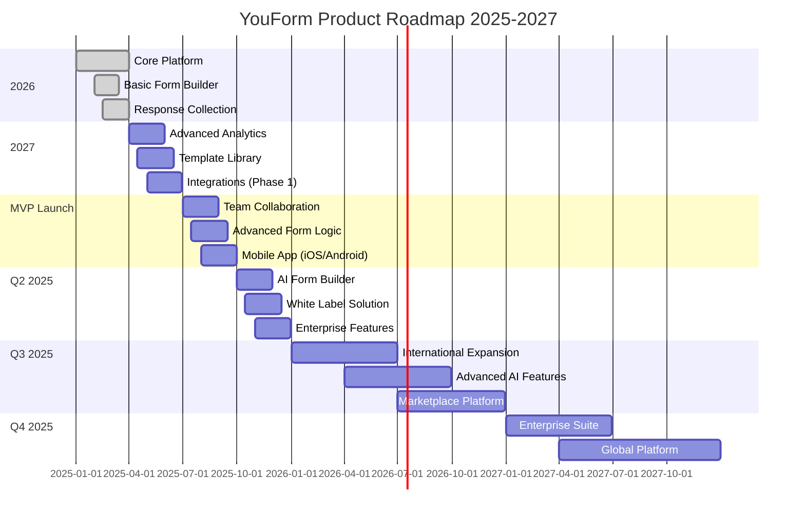

# 🗺️ Product Roadmap
## YouForm - SaaS de Formulários Web

### 🎯 Visão Estratégica 2025-2027

O roadmap do YouForm está estruturado para transformar a plataforma na **alternativa líder ao Typeform** no mercado brasileiro e expandir para mercados internacionais, mantendo nosso diferencial de **acessibilidade** e **simplicidade**.

### 📅 Timeline Executivo



### 🚀 Fase 1: MVP e Fundação (Q1 2025) ✅

#### Objetivos Alcançados
- ✅ **Core Platform**: Infraestrutura base com Supabase + Next.js
- ✅ **Form Builder**: Editor drag-and-drop intuitivo
- ✅ **Response Collection**: Sistema de coleta e armazenamento
- ✅ **Basic Analytics**: Métricas essenciais de conversão
- ✅ **User Management**: Autenticação e perfis de usuário

#### Métricas de Sucesso (Q1)
- ✅ 500+ usuários registrados
- ✅ 1.200+ formulários criados
- ✅ 15.000+ respostas coletadas
- ✅ 4.2/5 rating de satisfação
- ✅ 99.8% uptime

### 📊 Fase 2: Crescimento e Diferenciação (Q2 2025)

#### 2.1 Advanced Analytics & Insights
**Prazo**: Abril - Maio 2025  
**Responsável**: Data Team  

**Features Principais:**
- **Funil de Conversão Detalhado**
  - Análise campo por campo
  - Identificação de pontos de abandono
  - Sugestões automáticas de otimização
  
- **Segmentação Avançada**
  - Análise por fonte de tráfego
  - Comportamento por dispositivo
  - Análise geográfica detalhada
  
- **Relatórios Customizáveis**
  - Dashboard personalizável
  - Exportação em múltiplos formatos
  - Agendamento de relatórios automáticos

**Impacto Esperado:**
- Aumentar retenção de usuários em 25%
- Melhorar taxa de conversão dos formulários em 15%
- Reduzir churn de usuários pagos em 20%

#### 2.2 Template Library & Marketplace
**Prazo**: Abril - Junho 2025  
**Responsável**: Design + Product Team  

**Categorias de Templates:**
```
📋 Templates por Categoria:
├── 💼 Negócios (25 templates)
│   ├── Lead Generation
│   ├── Customer Feedback
│   ├── Event Registration
│   └── Product Survey
├── 🎓 Educação (20 templates)
│   ├── Course Evaluation
│   ├── Student Registration
│   ├── Research Survey
│   └── Feedback Forms
├── 🏥 Saúde (15 templates)
│   ├── Patient Intake
│   ├── Appointment Booking
│   ├── Health Assessment
│   └── Satisfaction Survey
├── 🎉 Eventos (18 templates)
│   ├── Event Registration
│   ├── RSVP Forms
│   ├── Feedback Collection
│   └── Vendor Applications
└── 🏪 E-commerce (22 templates)
    ├── Product Reviews
    ├── Return Requests
    ├── Customer Support
    └── Market Research
```

**Template Marketplace:**
- Sistema de templates premium
- Templates criados pela comunidade
- Revenue sharing com criadores (70/30)
- Sistema de rating e reviews

#### 2.3 Integrations Hub (Phase 1)
**Prazo**: Maio - Junho 2025  
**Responsável**: Backend Team  

**Integrações Prioritárias:**
1. **Email Marketing** (Maio)
   - Mailchimp ✅
   - ConvertKit ✅
   - ActiveCampaign 🔄
   - RD Station 📋

2. **CRM Systems** (Maio-Junho)
   - HubSpot ✅
   - Salesforce 🔄
   - Pipedrive 📋
   - Agendor 📋

3. **Analytics & Tracking** (Junho)
   - Google Analytics ✅
   - Facebook Pixel 🔄
   - Google Tag Manager 📋
   - Hotjar 📋

4. **Productivity Tools** (Junho)
   - Slack ✅
   - Discord 🔄
   - Telegram 📋
   - Microsoft Teams 📋

### 🤝 Fase 3: Colaboração e Mobilidade (Q3 2025)

#### 3.1 Team Collaboration Features
**Prazo**: Julho - Agosto 2025  
**Responsável**: Product Team  

**Funcionalidades:**
- **Workspaces**: Organização por equipes
- **Role-based Access**: Diferentes níveis de permissão
- **Real-time Collaboration**: Edição simultânea de formulários
- **Comments & Reviews**: Sistema de feedback interno
- **Version Control**: Histórico de alterações
- **Team Analytics**: Métricas consolidadas da equipe

**Planos de Pricing:**
```
Team Plan - R$ 149/mês
├── Até 5 usuários
├── Workspaces ilimitados
├── 50.000 respostas/mês
├── Colaboração em tempo real
├── Analytics avançados
└── Suporte prioritário

Business Plan - R$ 299/mês
├── Até 15 usuários
├── 150.000 respostas/mês
├── White-label básico
├── API completa
├── Integrações premium
└── Suporte dedicado
```

#### 3.2 Advanced Form Logic
**Prazo**: Julho - Setembro 2025  
**Responsável**: Frontend Team  

**Recursos Avançados:**
- **Conditional Logic**: Campos que aparecem/desaparecem baseado em respostas
- **Skip Logic**: Pular seções baseado em critérios
- **Calculation Fields**: Campos que calculam valores automaticamente
- **Multi-page Forms**: Formulários divididos em etapas
- **Progress Indicators**: Barras de progresso personalizáveis
- **Save & Resume**: Salvar progresso e continuar depois

#### 3.3 Mobile Apps (iOS & Android)
**Prazo**: Agosto - Setembro 2025  
**Responsável**: Mobile Team  

**Features Mobile:**
- **Offline Form Creation**: Criar formulários sem internet
- **Push Notifications**: Alertas de novas respostas
- **Mobile-optimized Builder**: Interface otimizada para touch
- **QR Code Scanner**: Facilitar compartilhamento
- **Voice-to-Text**: Criação de campos por voz
- **Camera Integration**: Upload direto de fotos

### 🤖 Fase 4: Inteligência Artificial (Q4 2025)

#### 4.1 AI-Powered Form Builder
**Prazo**: Outubro - Novembro 2025  
**Responsável**: AI Team  

**Capacidades de IA:**
- **Smart Form Generation**: Criar formulários a partir de descrição
- **Field Suggestions**: Sugerir campos baseado no contexto
- **Question Optimization**: Melhorar perguntas para maior conversão
- **Auto-translation**: Tradução automática para múltiplos idiomas
- **Sentiment Analysis**: Análise de sentimento das respostas
- **Fraud Detection**: Detectar respostas fraudulentas

**Exemplo de Uso:**
```
Usuário: "Preciso de um formulário para pesquisa de satisfação de restaurante"

AI Response:
✨ Formulário gerado automaticamente:
1. Como você avaliaria a qualidade da comida? (Rating 1-5)
2. O atendimento foi satisfatório? (Sim/Não + Comentário)
3. Você recomendaria nosso restaurante? (NPS)
4. Qual prato você mais gostou? (Texto livre)
5. Sugestões de melhoria? (Textarea)

🎯 Otimizações sugeridas:
- Adicionar campo de frequência de visita
- Incluir avaliação do ambiente
- Adicionar opção de contato para follow-up
```

#### 4.2 White Label Solution
**Prazo**: Outubro - Dezembro 2025  
**Responsável**: Platform Team  

**Recursos White Label:**
- **Custom Branding**: Logo, cores, domínio personalizado
- **Custom Domain**: forms.suaempresa.com
- **API Completa**: Integração total com sistemas existentes
- **Custom CSS**: Personalização avançada de design
- **Embedded Solutions**: Incorporar em qualquer sistema
- **Multi-tenant Architecture**: Isolamento completo de dados

**Pricing White Label:**
```
Enterprise Plan - R$ 999/mês
├── White-label completo
├── Domínio personalizado
├── 500.000 respostas/mês
├── API ilimitada
├── Suporte 24/7
├── SLA 99.9%
└── Onboarding dedicado
```

### 🌍 Fase 5: Expansão Internacional (2026)

#### 5.1 Multi-language Platform
**Q1 2026**: Suporte completo para 8 idiomas
- Português (Brasil) ✅
- Inglês (US/UK) 🔄
- Espanhol (ES/LATAM) 📋
- Francês 📋
- Alemão 📋
- Italiano 📋
- Japonês 📋
- Chinês (Simplificado) 📋

#### 5.2 Regional Compliance
**Q1-Q2 2026**: Adequação às regulamentações locais
- **GDPR** (Europa): Compliance completo
- **CCPA** (Califórnia): Proteção de dados
- **PIPEDA** (Canadá): Privacidade
- **LGPD** (Brasil): Já implementado ✅

#### 5.3 Local Payment Methods
**Q2 2026**: Métodos de pagamento regionais
- **Brasil**: PIX, Boleto, Cartões ✅
- **Europa**: SEPA, iDEAL, Giropay
- **Ásia**: Alipay, WeChat Pay, PayPal
- **América Latina**: Mercado Pago, PayU

### 🚀 Fase 6: Plataforma Avançada (2026-2027)

#### 6.1 Advanced AI & Machine Learning
**2026**: Recursos de IA de próxima geração
- **Predictive Analytics**: Prever comportamento de usuários
- **Auto-optimization**: Otimização automática de formulários
- **Smart Routing**: Direcionamento inteligente de leads
- **Personalization Engine**: Formulários personalizados por usuário
- **Voice Forms**: Formulários por comando de voz
- **Computer Vision**: Análise automática de imagens enviadas

#### 6.2 Enterprise Suite
**2027**: Solução completa para grandes empresas
- **Advanced Workflows**: Automações complexas
- **Multi-brand Management**: Gerenciar múltiplas marcas
- **Advanced Security**: SOC 2, ISO 27001 compliance
- **Dedicated Infrastructure**: Infraestrutura dedicada
- **Custom Integrations**: Integrações sob medida
- **Professional Services**: Consultoria e implementação

#### 6.3 Marketplace Ecosystem
**2027**: Ecossistema completo de terceiros
- **Plugin Marketplace**: Extensões desenvolvidas por terceiros
- **Template Store**: Marketplace de templates premium
- **Integration Partners**: Programa de parceiros
- **Developer Platform**: APIs e SDKs para desenvolvedores
- **Certification Program**: Certificação de parceiros

### 📊 Métricas de Sucesso por Fase

#### Métricas de Produto
```
2025 Targets:
├── 50.000 usuários ativos mensais
├── 500.000 formulários criados
├── 10M+ respostas coletadas
├── 95% customer satisfaction
└── 15% market share (Brasil)

2026 Targets:
├── 200.000 usuários ativos mensais
├── 2M formulários criados
├── 50M+ respostas coletadas
├── Expansão para 5 países
└── $10M ARR

2027 Targets:
├── 500.000 usuários ativos mensais
├── 5M formulários criados
├── 100M+ respostas coletadas
├── Presença global (20+ países)
└── $25M ARR
```

#### Métricas de Negócio
```
Revenue Milestones:
├── Q2 2025: $100K MRR
├── Q4 2025: $500K MRR
├── Q2 2026: $1M MRR
├── Q4 2026: $2M MRR
└── Q4 2027: $5M MRR

Customer Metrics:
├── CAC: <$50 (2025) → <$30 (2027)
├── LTV: $300 (2025) → $800 (2027)
├── Churn: <8% (2025) → <5% (2027)
├── NPS: >50 (2025) → >70 (2027)
└── Conversion: 15% (2025) → 25% (2027)
```

### 🎯 Estratégias de Execução

#### Metodologia de Desenvolvimento
- **Agile/Scrum**: Sprints de 2 semanas
- **Feature Flags**: Deploy gradual de funcionalidades
- **A/B Testing**: Validação contínua de hipóteses
- **User Feedback**: Ciclo rápido de feedback
- **Data-Driven**: Decisões baseadas em dados

#### Priorização de Features
**Framework RICE (Reach × Impact × Confidence ÷ Effort):**
1. **High Priority** (RICE > 50): Features críticas para crescimento
2. **Medium Priority** (RICE 20-50): Melhorias importantes
3. **Low Priority** (RICE < 20): Nice-to-have features

#### Risk Management
**Principais Riscos e Mitigações:**
- **Competição**: Diferenciação contínua e inovação
- **Escalabilidade**: Arquitetura preparada para crescimento
- **Regulamentações**: Compliance proativo
- **Talento**: Programa de retenção e atração
- **Funding**: Diversificação de fontes de capital

### 🔄 Processo de Revisão

#### Revisões Trimestrais
- **OKR Review**: Avaliação de objetivos e resultados
- **Roadmap Adjustment**: Ajustes baseados em feedback
- **Resource Allocation**: Realocação de recursos
- **Market Analysis**: Análise de mercado e competição

#### Feedback Loops
- **Customer Advisory Board**: Conselho de clientes estratégicos
- **User Research**: Pesquisas regulares com usuários
- **Sales Feedback**: Input da equipe de vendas
- **Support Insights**: Análise de tickets de suporte

---

**Versão**: 1.0  
**Última Atualização**: 16/06/2025  
**Próxima Revisão**: 30/06/2025  
**Owner**: Product Team

> 🎯 **Nota**: Este roadmap é um documento vivo que será atualizado trimestralmente baseado em feedback de usuários, métricas de produto e mudanças no mercado.