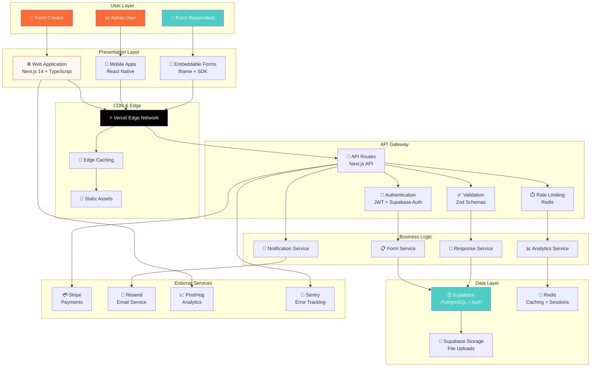
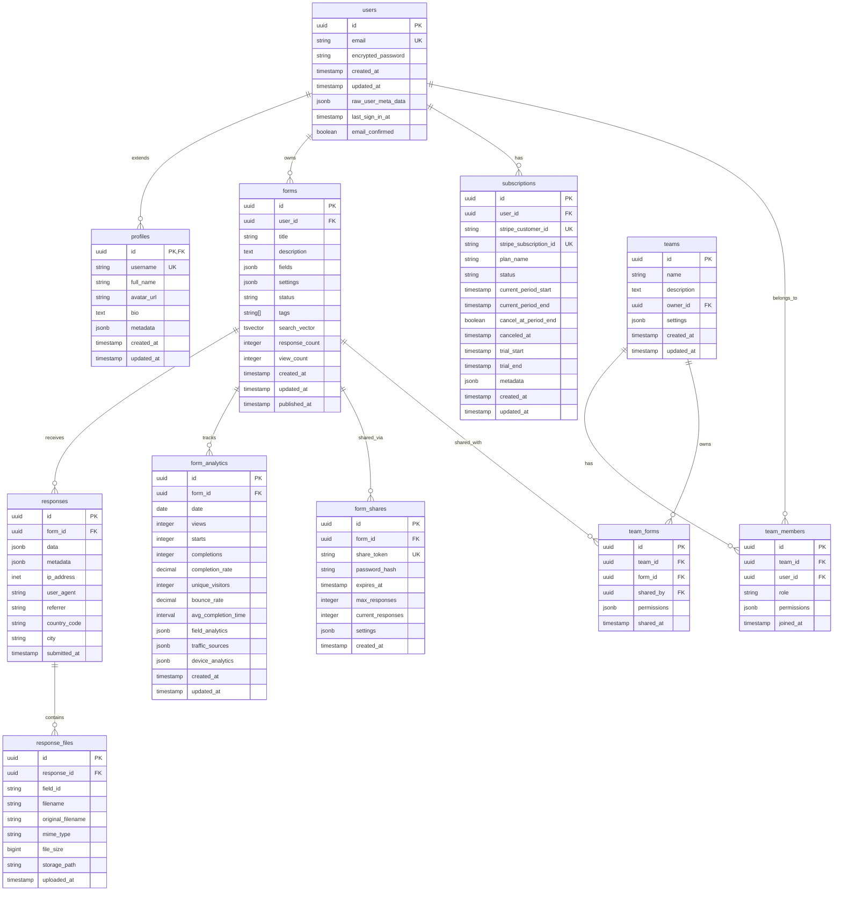
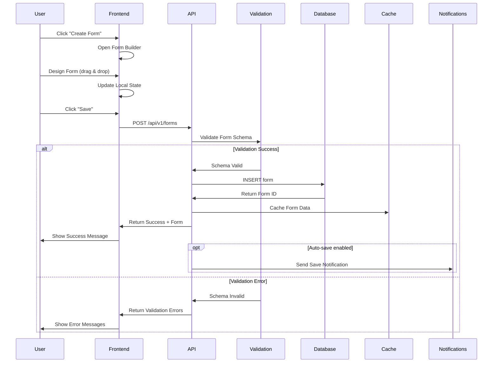
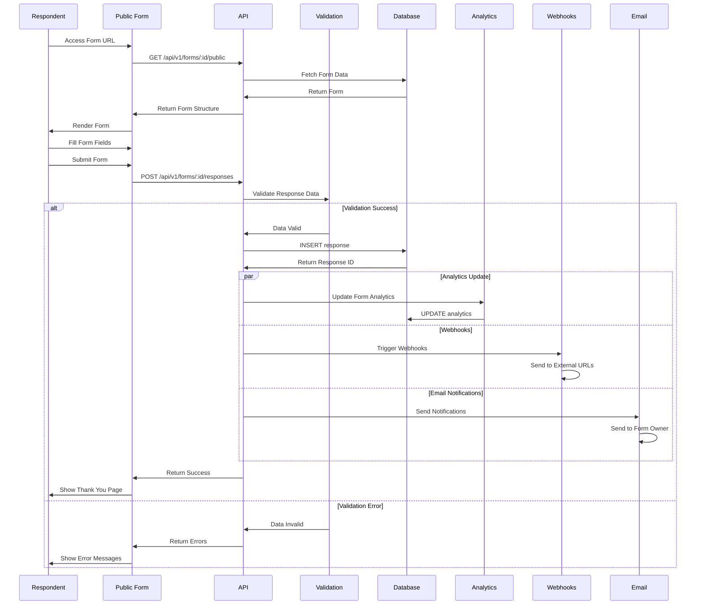
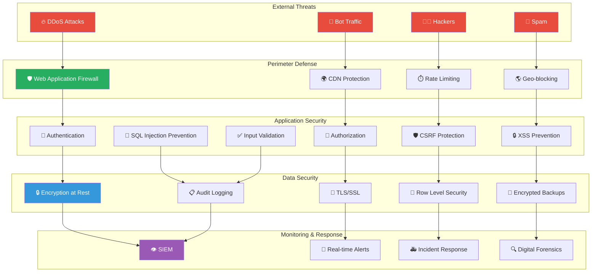
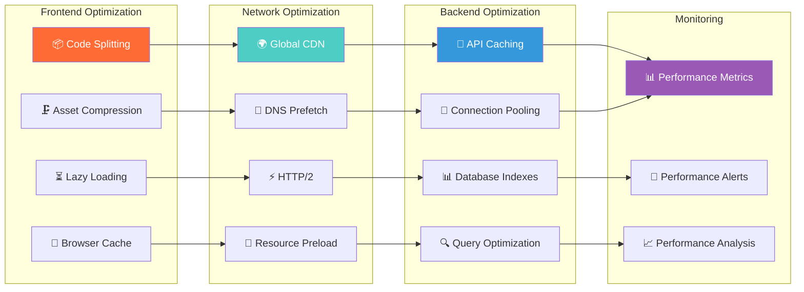

# 📐 Technical Diagrams & Visual Assets
## YouForm - SaaS de Formulários Web

### 🎨 Design System Overview

Baseado na identidade visual apresentada na imagem de referência, o YouForm segue um design system moderno e acessível:

#### Paleta de Cores Principal
```css
/* YouForm Color Palette */
:root {
  /* Primary Colors */
  --primary-orange: #FF6B35;      /* Laranja vibrante - CTAs principais */
  --primary-teal: #4ECDC4;        /* Verde-azulado - Botões secundários */
  
  /* Neutral Colors */
  --background-cream: #FFF8F0;    /* Fundo principal suave */
  --background-white: #FFFFFF;    /* Cards e containers */
  --text-dark: #2C3E50;          /* Texto principal */
  --text-gray: #7F8C8D;          /* Texto secundário */
  --border-light: #E8E8E8;       /* Bordas sutis */
  
  /* Status Colors */
  --success-green: #27AE60;      /* Sucesso e confirmações */
  --warning-yellow: #F39C12;     /* Avisos e alertas */
  --error-red: #E74C3C;          /* Erros e validações */
  --info-blue: #3498DB;          /* Informações e dicas */
}
```

#### Typography Scale
```css
/* YouForm Typography */
.typography {
  /* Font Family */
  font-family: 'Inter', -apple-system, BlinkMacSystemFont, sans-serif;
  
  /* Scale */
  --text-xs: 0.75rem;    /* 12px */
  --text-sm: 0.875rem;   /* 14px */
  --text-base: 1rem;     /* 16px */
  --text-lg: 1.125rem;   /* 18px */
  --text-xl: 1.25rem;    /* 20px */
  --text-2xl: 1.5rem;    /* 24px */
  --text-3xl: 1.875rem;  /* 30px */
  --text-4xl: 2.25rem;   /* 36px */
  
  /* Weights */
  --font-normal: 400;
  --font-medium: 500;
  --font-semibold: 600;
  --font-bold: 700;
}
```

### 🏗️ System Architecture Diagram



### 📱 User Interface Mockups

#### 1. Landing Page Design

```
┌─────────────────────────────────────────────────────────────────────────────┐
│ 📋 YouForm                    🏠 Home  📊 Templates  💰 Pricing  👤 Login    │
├─────────────────────────────────────────────────────────────────────────────┤
│                                                                             │
│  🎯 Rated 5 ⭐ on Capterra →                                               │
│                                                                             │
│  The most affordable                        ┌─────────────────────────────┐ │
│  Typeform alternative                       │ 👋 Welcome! This is a live  │ │
│                                             │    Youform                  │ │
│  Youform is a form builder that provides   │                             │ │
│  UNLIMITED forms and responses for FREE.    │ Feel free to fill it out to │ │
│  You can add logic, custom domains, upload │ see how a published         │ │
│  files, embed forms on your website,       │ Youform looks and feels 👀  │ │
│  and much more 🤯                          │                             │ │
│                                             │                             │ │
│  [🚀 Create free account]                   │     [🎯 Let's Start]        │ │
│                                             │                             │ │
│  Have a Typeform URL? Import it now         │ or click here to open this  │ │
│                                             │ form in a new tab           │ │
│  ✅ Unlimited responses  ✅ No credit card required                        │ │
│                                                                             │ │
│  "Youform is an absolute joy to use."                                      │ │
│  👤 Pieter Levels                                                          │ │
│  Founder Nomadlist and RemoteOK                                            │ │
│  400k+ Followers on Twitter                                                │ │
│                                                                             │ │
│                    intuitive builder →                                     │ │
│                                                                             │ │
└─────────────────────────────────────────────────────────────────────────────┘
```

#### 2. Dashboard Interface

```
┌─────────────────────────────────────────────────────────────────────────────┐
│ 📋 YouForm    🏠 Dashboard  📊 Analytics  ⚙️ Settings  👤 Maria Silva       │
├─────────────────────────────────────────────────────────────────────────────┤
│                                                                             │
│  👋 Olá, Maria! Bem-vinda de volta                                          │
│                                                                             │
│  📊 Seus números hoje:                                                      │
│  ┌─────────────┐ ┌─────────────┐ ┌─────────────┐ ┌─────────────┐          │
│  │     15      │ │    127      │ │     89      │ │   70.1%     │          │
│  │   Forms     │ │   Views     │ │ Responses   │ │ Conv Rate   │          │
│  │   📈 +3     │ │   📈 +12    │ │   📈 +8     │ │   📈 +2.1%  │          │
│  └─────────────┘ └─────────────┘ └─────────────┘ └─────────────┘          │
│                                                                             │
│  🎨 [+ Criar Novo Formulário]  📋 [Ver Templates]  📤 [Importar]           │
│                                                                             │
│  📋 Seus Formulários Recentes:                                             │
│  ┌─────────────────────────────────────────────────────────────────────┐   │
│  │ 📝 Pesquisa de Satisfação do Cliente        🟢 Publicado           │   │
│  │    42 respostas • Criado há 3 dias • Taxa de conversão: 68.2%     │   │
│  │    [📊 Analytics] [✏️ Editar] [📤 Compartilhar] [⚙️ Configurar]    │   │
│  └─────────────────────────────────────────────────────────────────────┘   │
│                                                                             │
│  ┌─────────────────────────────────────────────────────────────────────┐   │
│  │ 📞 Formulário de Contato                     🟡 Rascunho           │   │
│  │    0 respostas • Criado há 1 dia • Última edição: há 2 horas      │   │
│  │    [✏️ Continuar Editando] [👁️ Preview] [🚀 Publicar]              │   │
│  └─────────────────────────────────────────────────────────────────────┘   │
│                                                                             │
│  ┌─────────────────────────────────────────────────────────────────────┐   │
│  │ 🎓 Avaliação do Curso                        🟢 Publicado           │   │
│  │    156 respostas • Criado há 1 semana • Taxa de conversão: 82.1%  │   │
│  │    [📊 Analytics] [✏️ Editar] [📤 Compartilhar] [📋 Duplicar]      │   │
│  └─────────────────────────────────────────────────────────────────────┘   │
│                                                                             │
│  📈 Quick Stats:                                                            │
│  • Formulário mais popular: Pesquisa de Satisfação (42 respostas)          │
│  • Melhor taxa de conversão: Avaliação do Curso (82.1%)                    │
│  • Total de visualizações esta semana: 1,247                               │
│                                                                             │
└─────────────────────────────────────────────────────────────────────────────┘
```

#### 3. Form Builder Interface

```
┌─────────────────────────────────────────────────────────────────────────────┐
│ ← Voltar  📝 Pesquisa de Satisfação  [💾 Salvar] [👁️ Preview] [🚀 Publicar] │
├─────────────────────────────────────────────────────────────────────────────┤
│                                                                             │
│ 🎨 CAMPOS DISPONÍVEIS        │  📋 SEU FORMULÁRIO                          │
│                              │                                             │
│ 📝 Texto Simples             │  📝 Pesquisa de Satisfação do Cliente       │
│ 📧 Email                     │  Ajude-nos a melhorar nossos serviços       │
│ 📞 Telefone                  │                                             │
│ 📅 Data                      │  ┌─────────────────────────────────────────┐ │
│ 🔢 Número                    │  │ Como você avalia nosso atendimento? *   │ │
│ 📄 Texto Longo              │  │                                         │ │
│ ☑️ Múltipla Escolha          │  │ ⭐⭐⭐⭐⭐                              │ │
│ 🔘 Escolha Única             │  │ 1 = Muito ruim  5 = Excelente          │ │
│ ⭐ Avaliação                 │  └─────────────────────────────────────────┘ │
│ 📎 Arquivo                   │                                             │
│ ✅ Sim/Não                   │  ┌─────────────────────────────────────────┐ │
│                              │  │ Deixe seu comentário                    │ │
│ 🎨 ELEMENTOS VISUAIS         │  │ ┌─────────────────────────────────────┐ │ │
│                              │  │ │ Conte-nos sobre sua experiência...  │ │ │
│ 📏 Divisor                   │  │ │                                     │ │ │
│ 📄 Texto HTML                │  │ │                                     │ │ │
│ 🖼️ Imagem                    │  │ │                                     │ │ │
│ 📊 Gráfico                   │  │ └─────────────────────────────────────┘ │ │
│                              │  └─────────────────────────────────────────┘ │
│ 🔧 CONFIGURAÇÕES             │                                             │
│                              │  ┌─────────────────────────────────────────┐ │
│ 🎨 Design & Tema             │  │ Você nos recomendaria? *                │ │
│ ⚙️ Comportamento             │  │                                         │ │
│ 🔔 Notificações              │  │ ○ Sim, definitivamente                  │ │
│ 🔐 Privacidade               │  │ ○ Provavelmente sim                     │ │
│ 📊 Analytics                 │  │ ○ Não tenho certeza                     │ │
│                              │  │ ○ Provavelmente não                     │ │
│                              │  │ ○ Não, definitivamente não              │ │
│                              │  └─────────────────────────────────────────┘ │
│                              │                                             │
│                              │  [🚀 Enviar Pesquisa]                      │
│                              │                                             │
└─────────────────────────────────────────────────────────────────────────────┘
```

### 📊 Database Entity Relationship Diagram



### 🔄 Data Flow Diagrams

#### Form Creation Flow



#### Form Response Flow



### 🔐 Security Architecture



### 📱 Mobile App Wireframes

#### Mobile Form Builder

```
┌─────────────────────┐
│ ← 📝 Form Builder   │
├─────────────────────┤
│                     │
│ 📋 Contact Form     │
│ ┌─────────────────┐ │
│ │ 📝 Name *       │ │
│ │ [____________]  │ │
│ └─────────────────┘ │
│                     │
│ ┌─────────────────┐ │
│ │ 📧 Email *      │ │
│ │ [____________]  │ │
│ └─────────────────┘ │
│                     │
│ ┌─────────────────┐ │
│ │ 📞 Phone        │ │
│ │ [____________]  │ │
│ └─────────────────┘ │
│                     │
│ ┌─────────────────┐ │
│ │ 📝 Message *    │ │
│ │ [____________]  │ │
│ │ [____________]  │ │
│ │ [____________]  │ │
│ └─────────────────┘ │
│                     │
│ [🚀 Send Message]   │
│                     │
│ ┌─────────────────┐ │
│ │ + Add Field     │ │
│ └─────────────────┘ │
│                     │
│ [💾 Save] [👁️ Preview] │
│                     │
└─────────────────────┘
```

### 🎯 Performance Optimization Flow



### 📊 Analytics Dashboard Mockup

```
┌─────────────────────────────────────────────────────────────────────────────┐
│ 📊 Analytics - Pesquisa de Satisfação                    📅 Últimos 30 dias │
├─────────────────────────────────────────────────────────────────────────────┤
│                                                                             │
│ ┌─────────────┐ ┌─────────────┐ ┌─────────────┐ ┌─────────────┐            │
│ │   1,247     │ │    892      │ │    634      │ │   71.1%     │            │
│ │   Views     │ │   Starts    │ │ Completions │ │ Conv Rate   │            │
│ │   📈 +12.3% │ │   📈 +8.7%  │ │   📈 +15.2% │ │   📈 +2.1%  │            │
│ └─────────────┘ └─────────────┘ └─────────────┘ └─────────────┘            │
│                                                                             │
│ 📈 Conversions Over Time                                                    │
│ ┌─────────────────────────────────────────────────────────────────────────┐ │
│ │ 100%│                                                                   │ │
│ │     │     ●●●                                                           │ │
│ │  80%│   ●●   ●●                                                         │ │
│ │     │ ●●       ●●                                                       │ │
│ │  60%│●           ●●                                                     │ │
│ │     │              ●●                                                   │ │
│ │  40%│                ●●                                                 │ │
│ │     │                  ●●                                               │ │
│ │  20%│                    ●●                                             │ │
│ │     │                      ●●                                           │ │
│ │   0%└─────────────────────────────────────────────────────────────────│ │
│ │     1   5   10   15   20   25   30 (days)                              │ │
│ └─────────────────────────────────────────────────────────────────────────┘ │
│                                                                             │
│ 🔍 Field Analysis                          🌍 Traffic Sources              │
│ ┌─────────────────────────────────────┐   ┌─────────────────────────────┐   │
│ │ 1. Nome completo                    │   │ 📧 Email: 35.2%             │   │
│ │ ████████████████████ 100% (892)    │   │ 📱 Social: 28.7%            │   │
│ │ ⏱️ Avg time: 12s                    │   │ 🔗 Direct: 22.1%            │   │
│ │                                     │   │ 🔍 Search: 14.0%            │   │
│ │ 2. Email                            │   └─────────────────────────────┘   │
│ │ ██████████████████▌  95% (848)      │                                     │
│ │ ⏱️ Avg time: 8s                     │   📱 Device Breakdown               │
│ │ ⚠️ 44 drop-offs                     │   ┌─────────────